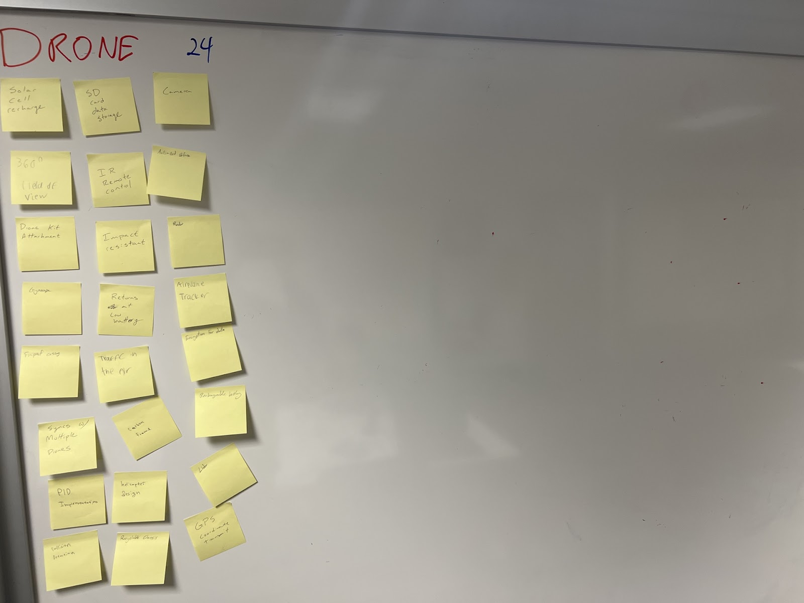

# Team 201: Design Ideation
## EGR 314 
## 1/20/23

## Initial Idea Generation:

We began the design ideation process by brainstorming over 100 design ideas. These ideas can be seen in Figure 1.

<figure class="image">  

  

   

</figure>
Figure 1: All generated Concepts

## Design Sortation and Ranking:

After brainstorming our 100 design ideas, we categorized them into 3 categories. These categories were Drone, Miscellaneous, and Weather Balloon. These categories can be viewed in more detail in Figures 2,3, and 4. Below. Once the various ideas were sorted, we began to rank our ideas. To accomplish this, we put the best ideas higher up and the less practical ideas further down.  

<figure class="image">  

  

   

</figure>
Figure 2: Concepts associated with “Drone”

<figure class="image">  

  

   

</figure>
Figure 3: Miscellaneous and “Water Quality”

<figure class="image">  

  

   

</figure>
Figure 4: Concepts associated with “Weather Balloon”

## Design Concepts:

### Design Concept 1:

The first design concept is a weather balloon which can be seen in Figure 5.

<figure class="image">  

  

   

</figure>
Figure 5: Concept #1: Weather Balloon 

### Design Premise:

The idea behind this prototype was to illustrate how a box could track the important values of a weather balloon. We have multiple key aspects shown in this model that are fundamental to the design. We have the balloon that will raise the device up in the sky to collect readings. We are discussing whether to use an actual weather balloon, a helium balloon, or a biodegradable balloon to limit waste. We have a strong string/rope that will connect the balloon to the top of the box whether it be on a hook or another method with a closed top. We have two currently undefined weather-based sensors that will be connected to the PCB inside of the unit inside the box. Connected to the top we have a bidirectional motor that will be the actuation and will be in charge of cutting the rope to bring the device back for the users. We also have attached a GPS tracker that will be utilized through wifi to allow us to receive the readings while also being able to track the balloon. Overall we think this is a very cool idea however the one major drawback we have is not wasting balloons and helium and the safe landing of the device to remain cost-effective.

### Design Concept 2:
The second design concept is Water Buoy Environmental Sensor which can be seen in Figures 6 and 7. 

<figure class="image">  

  

   

</figure>
Fig. 6: Top View of Design Concept #2

<figure class="image">  

  

   

</figure>
Fig. 7: Cross-section side view of Design Concept #2 

### Design Premise:

Design concept #2 looks to act as a deployable water quality  and condition sensor. The user would place the buoy in a body of water to collect and transmit data based on the attached sensors. The main point of actuation is in a sample collection bay door, which sits under the surface of the water. Once the door closes, the water sample can be collected later when the device is retrieved for lab analysis.

The microcontroller and batteries will be stored in a sealed chamber within the main housing of the device, with wires running out connecting to the motor, lights, and external sensors, and sealed to prevent water from damaging the electronics.. The body of the device will be constructed from some waterproof material, most likely printed PLA. One major risk of this design is damaged to the sensitive components due to moisture or water. Some inexpensive moisture control strategies would be including silica gel packets within the electronics housing. 

### Design Concept 3:

The third design concept is a Weather Drone which can be viewed in Figure 8.

<figure class="image">  

  

   

</figure>
Fig. 8: Concept #3: “Drone Kit”

### Design Premise:

The idea for the drone is to take advantage of a drone’s capabilities to reach different altitudes quickly and be programmed to take a certain flight path. We would attach numerous sensors to the drone and try to upgrade its chassis and casing if need be. It would be collecting data from these sensors and storing them on an SD card and then transferring them over wifi once it can connect. 

The main concepts are shown in the image, but some were not able to be included due to them being internal components. These include a rechargeable battery, a way to track the drone using GPS, some form of collision detection, implementing PID control form the rotors, implementing Lidar to try and prevent collisions, the ability to sync with multiple drones, on-board encryption for the data(specifically the GPS data), a way to prevent the drone from accidently flying into restricted airspace, returning to base in case of a low battery, a gyroscope for stability, and a way to remotely control the drone. 

An example of usage would be wanting to track weather patterns in an area throughout a day. A user would set a flight path for the drone or even use a pre-programmed flight path (such as a grid pattern or a figure eight) and it would collect data throughout the day, autonomously returning to recharge and transfer any data it had collected. The user could change the height it operates at, to check weather patterns closer to the ground or higher up. 

