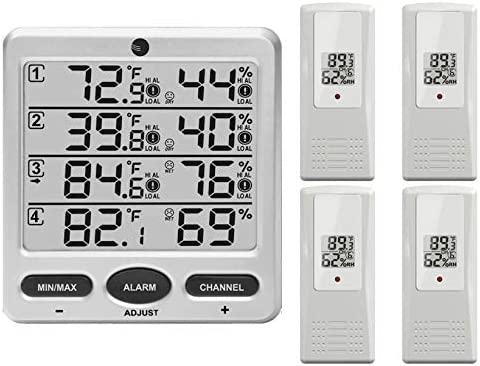
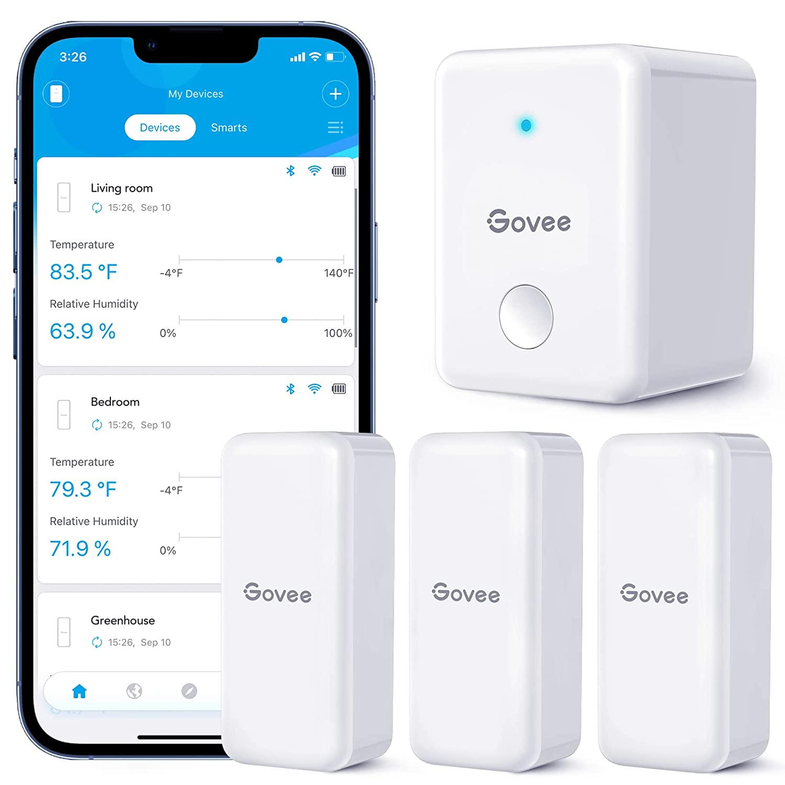
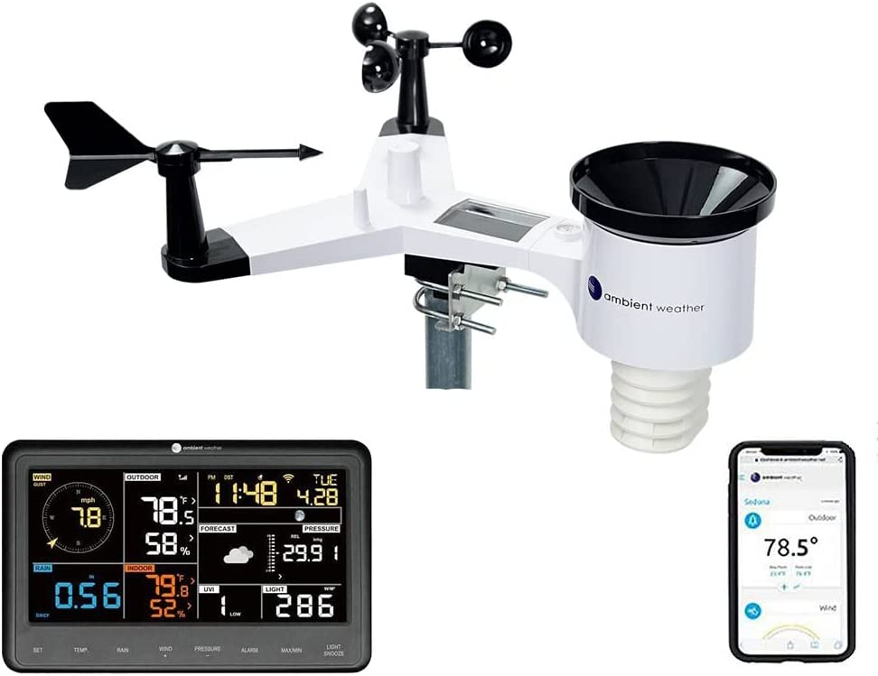
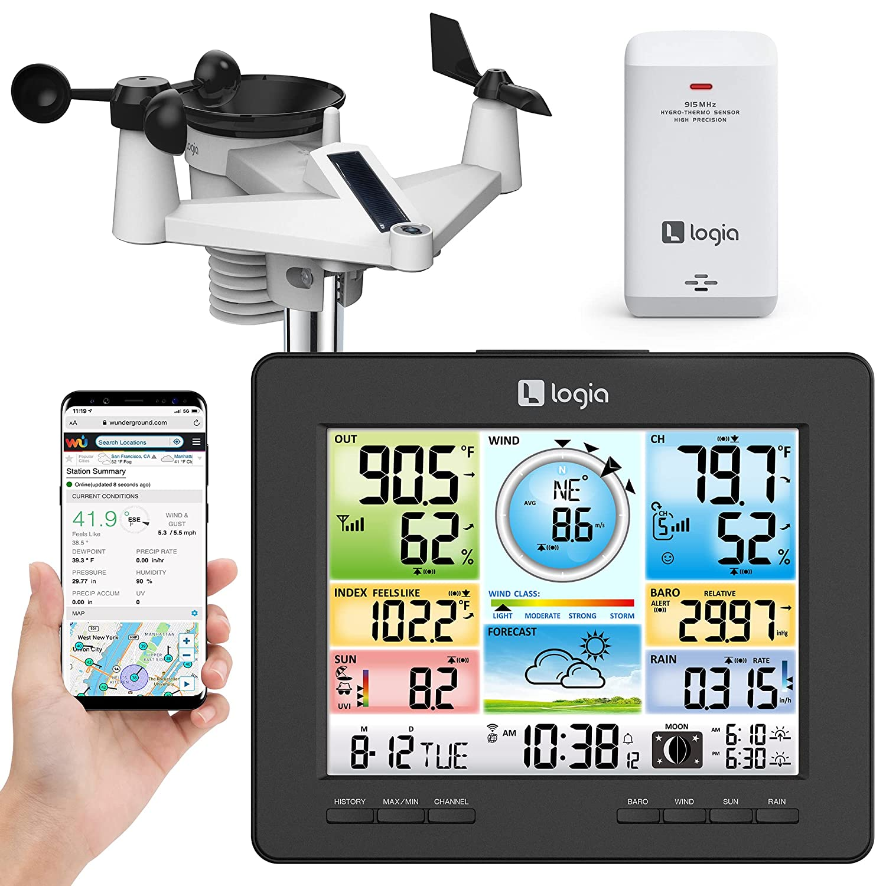
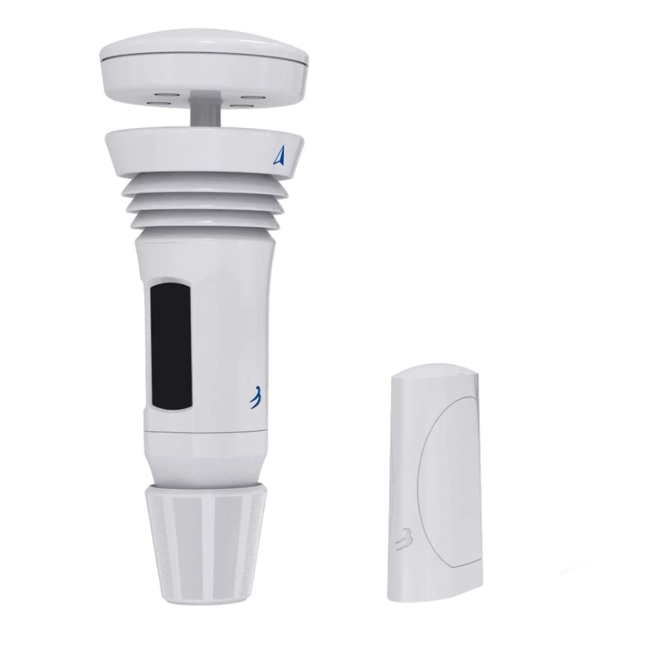

# User Needs

## VOC Benchmarking

## Search #1

*Keywords: "Drone Weather Sensors"*

Search Results Link: [Link](https://www.amazon.com/s?k=drone+weather+senesors&crid=13IY3UI1HSTTQ&sprefix=drone+weather+senesors%2Caps%2C123&ref=nb_sb_noss)

**Selected Products:**

1. [Ambient Weather Wireless Indoor/Outdoor 8-Channel Thermo-Hygrometer with Four Remote Sensors WS-10-X4](https://www.amazon.com/Ambient-Weather-WS-10-X4-Wireless-Thermo-Hygrometer/dp/B01EIBJO76/ref=sr_1_4?crid=13IY3UI1HSTTQ&keywords=drone+weather+sensors&qid=1673646188&sprefix=drone+weather+senesors%2Caps%2C123&sr=8-4)

<figure class="image">  

  

   

</figure>

Price: $71.99

Vendor: Ambient Weather

Description: Simple to read, simple to use, and affordable, the WS-10-X4 includes an indoor thermo-hygrometer inside the console, and four remote thermometer-hygrometer sensors (F007TH), which are all displayed at the same time. The console includes audible and visual alarms when temperature and humidity exceed your pre-set minimum and maximum alarm settings.The console displays temperature and humidity, minimum and maximum temperature and humidity, which can be manually reset. The scroll mode allows you to view the indoor thermometer-hygrometer and channels 4 through 8 without pressing any buttons. In scroll mode, all of the indoor and detected outdoor sensors will be displayed in five-second intervals. The console also includes an optional temperature and humidity calibration feature for the utmost accuracy.

### Positive Comments

#### Review #1:

“This thermometer system is nothing but the best. I purchased it to monitor the temperatures in different places where water pipes may freeze. An added bonus to the system is that customized high and low alarms can be set for each transmitter channel for the temperature and humidity. In my case I set my alarm to warn me if a temperature reading gets too close to the freezing point. Another nice feature is that if a transmitter fails, it can be easily replaced with a new one without the need of replacing the entire system.”

Customer Needs: 
* Alarms that alert the user if a temperature is being crossed.
* Having Custom Ranges is important for the consumer.
* Parts need to be easily replaceable

#### Review #2:

"It seems reliable so far after using it for 6 months. The 4 remotes were reading all within a degree from each other and can be adjusted on the main unit if needed. I like that they report both degrees and humidity. We use it to measure temp/hum in our garage, inside two dog kennels in the garage and in our heated doghouse out in the yard. The main unit is inside the middle of the house and is about 60ft away from the farthest remote that’s in the yard kennel. It has no problem maintaining contact.
I do also like the flexibility they built in to let the user determine how they want the 4th remote set up: you can set it to alternate between the main unit and the 4th remote. But you can also set it to just show the main unit or just the 4th remote (we set it for this last option). I want to compliment the manufacturer for building in this option because too often nowadays we’re dictated by software programmers working in their little cubical how to use our stuff… The only point for improving I can think of is to make it a bit easier to differentiate between temp and humidity. The display has nice large numbers but they are the same size and shape for both temp and humidity . Maybe make the humidity a little but smaller?"

Customer Needs:
* Long Lifespans so customers do not have to keep buying new ones
* Distinguishable Numbers for the different values we measure 
* Long Range of Connectivity 

#### Review #3

"I have this monitoring 4 freezers and 2 of them are a chest and upright in a detached garage that is 150 feet away and the signal has to travel through 3 walls (not counting the metal doors of the freezers) to the base unit.
In those 2 - I had to suspend the sensors from a shelf and have them facing the door in order to get the range I needed. (NOT the products fault ) The FOURTH wall to get it into the house defeated the system though so I hung it in the garage next to the door where I walk in the house and honestly - I think I prefer it there as to inside the house - I see it every time I walk in the house. Just a side note: Only 3 of the sensors (#'s 2,3 & 4 ) have "temp alarms" (as the instructions tell you ) but I just made sure the #1 sensor was on a freezer that already has an audible temp sensor.( #1 was designed to be the "outside" temperature )
They were super easy to setup - maybe 15 minutes to get them all set and they were all within 2 degrees of what my mechanical thermometers in the freezers said."

Customer Needs:
* Signal Is Strong and Can Reach Anywhere
* Base Unit is Portable to be Seen Everywhere
* Alarms Are Helpful in Case of Problem

### Negative Comments

#### Review #1:

"Remote sensors have no slot for zip tie.
Battery compartment on remote sensor closes with a screw in plastic. Will fail in a few uses.
I was unable to successfully connect more than 2 out of 3 remote sensors at a time.
I consider the product a failure and do not recommend.'

Customer Needs:
* Needs to be easily attachable to things
* Batteries need to be easy to switch out in case if it dies
* Optimal connectivity

#### Review #2:

"It worked as advertised for a few months. I placed the units in three different, covered outdoor aviaries. After a few months. The humidity sensor failed on one. Then another measured 95 degrees, when it was only 85 degrees. One by one each outdoor unit failed. A total waste of our time and money."

Customer Needs:
* Needs to have longevity and not break quickly
* Needs to have accurate readings 
* Outdoor sensors may need more protective than the indoor ones

#### Review #3:

"It worked as advertised for a few months. I placed the units in three different, covered outdoor aviaries. After a few months. The humidity sensor failed on one. Then another measured 95 degrees, when it was only 85 degrees. One by one each outdoor unit failed. A total waste of our time and money."

Customer Needs:
* Need to be Waterproof
* Needs to Display Accurate Humidity
* Needs Longevity

2. [Govee WiFi Hygrometer Thermometer 3 Pack H5151, Indoor Outdoor Wireless Temperature Humidity Sensor Monitor with Remote App Notification Alert, 2 Years Free Data Storage Export, for Home, Greenhouse](https://www.amazon.com/Govee-Hygrometer-Thermometer-H5151-Temperature/dp/B09BVLP9C5/ref=sxin_15_pa_sp_search_thematic_sspa?content-id=amzn1.sym.14a246c3-7a62-40bf-bdd0-5ac67c2a1913%3Aamzn1.sym.14a246c3-7a62-40bf-bdd0-5ac67c2a1913&crid=13IY3UI1HSTTQ&cv_ct_cx=drone+weather+sensors&keywords=drone+weather+sensors&pd_rd_i=B09BVLP9C5&pd_rd_r=767f4d49-dabf-4095-a3a2-30b5f1662648&pd_rd_w=ID2Ay&pd_rd_wg=xIGoo&pf_rd_p=14a246c3-7a62-40bf-bdd0-5ac67c2a1913&pf_rd_r=CA9ZF9T5Q4PNEXXS9BB3&qid=1673646188&sprefix=drone+weather+senesors%2Caps%2C123&sr=1-1-a73d1c8c-2fd2-4f19-aa41-2df022bcb241-spons&psc=1&spLa=ZW5jcnlwdGVkUXVhbGlmaWVyPUFGRjc1OFkxVVdBQU0mZW5jcnlwdGVkSWQ9QTAxNjEzOTExTUpHTEpCNFZKMFlHJmVuY3J5cHRlZEFkSWQ9QTA4MDk5ODkxWTA1SElYOEEyR1JBJndpZGdldE5hbWU9c3Bfc2VhcmNoX3RoZW1hdGljJmFjdGlvbj1jbGlja1JlZGlyZWN0JmRvTm90TG9nQ2xpY2s9dHJ1ZQ==)

<figure class="image">  

  

   

</figure>

Price: $69.99

Vendor: Govee

Description: Govee is a global leading smart home brand dedicated to providing personalized and fun life experiences through continuous innovations. With the help of our smart sensors and Gove Home app, you can enjoy a healthier, safer, and more convenient lifestyle

### Positive Comments

#### Review #1:

"I really like these thermometer/hygrometers. They are quite precise, displaying temperature and humidity to the tenth. The historical data is fantastic as well, as it's easy to look at trends over hours, days, weeks, months, or the entire year. Although I've only had them for a couple months, so no long-term experience yet. Initially, I tried one in the RV freezer, one in the RF refrigerator, and one in the RV living room. Yes, there is an "RV" trend there. We are camping out in the RV while the house is remodeled. Anyway, we wanted to monitor the temps in the freezer and fridge zone to ensure they were cooling to the right levels. And they were. And yes, the signal worked right through the refrigerator doors. The base unit was placed about 15 feet away under the dinette (cause that's where the outlet is). :) As the season progressed and it got much colder, we were more concerned with the temperatures around the freshwater tank and the underbelly area. And we were right to be concerned. The freshwater tank or the feed from the tank to the pump froze when we had the cold snap in early December (Oregon). How do I know it was the tank or tank line to the pump? Well, our RV has a feed hose with a cutoff valve right before the pump. So, I filled a bucket of water, put the feeder hose in the bucket, and ran the pump. Pressured right up and the sinks worked. So, frozen tank or feed line. Anyway, we skirted the RV with cellular foam board, put a small space heater underneath with a thermal switch, and placed the thermostats. One thermostat was hung under the frame in the now enclosed underside of the RV. One in the pump area with all the crazy water lines. And one just outside the RV hanging from an external panel. The lanyards came in handy for that. We were happy to see the underbelly temps come slowly back up above freezing. At this moment (22 Dec 22), it's 36.9 degrees in the underbelly, and 10.4 degrees just on the outside of the RV. And yes, the water unfroze, and everything works again. Yay! We carefully checked for any leaks and were happy to not find any. So, we really like the sensors. They are connected over our home network, so I can check them anywhere, anytime. The Govee app is nice and easy to use, and it's easy to add the devices. I did get one bum battery that died in the first week, but that inconsequential. The others are running strong. And they work fine with our Eneloop rechargeables. Small, precise, and wireless. Good stuff.'

Customer Needs:
* Provides precise data
* storical Data for analyzing trends
* Wireless and can connect to an easilty navigatable app.

#### Review #2:

"Got these to test out our fridge temperature settings to make sure they were within range and confirm that my fridge is still working properly. The graphs of historical data are really cool and let me see how well the appliance is doing over time which was exactly what I needed. From that data, I was able to play around with things and figured out that there was a container blocking airflow in the fridge which affected the thermostat. Saved me from thinking I needed a new fridge.
Also, added it to my freezer and chest freezer to monitor those temperatures which showed I could turn down the chest freezer significantly to save energy. These also double as a warning if somebody left the fridge door open by setting an upper limit alarm for the temperature. The only downside I've encountered in the last two months is not being able to turn off the low limit warnings which occasionally trigger for the sensors I put in the freezer even when set to the lowest value. Haven't had to replace the batteries yet, even for the ones in the freezer."

Customer Needs:
* Withstands a large variety of temperatures without having problems. 
* Save battery life regardless of temperatures so difficult ones like ones in cold places will be optimal.
* Graphs of Historical Data are very helpful.

#### Review #3:

"I'm pretty impressed. These are very small sensors, just a bit fatter than an AA battery. I scattered them in areas of the building I needed to monitor for freeze protection. It was really easy to connect them and I'm able to monitor temps remotely with the app. They connect to the gateway with blue tooth and you use bluetooth to tell the gateway your wifi info which it then uses to push data to server for the app. I'll have to see how long the AAA batteries in the sensors last but the battery level for each sensor is indicated on the app so no stress. The gateway plugs into an outlet and is just a little cube. Like other reviews mention it would be great to buy a couple more sensors without purchasing another gateway but I suppose another gateway wouldn't hurt either."

Customer Needs: 
* Tiny and Portable
* Easily Collectable
* Multiple Sensors to One System

### Negative Comments:

#### Review #1:

"I really want to love these, but I have 2 issues.
1. If you don't catch the battery before it dies then the sensor is shot. You can't just replace the battery and have the sensor pick back up and if you delete the sensor from your account to reset and attempt to reconnect it then it never works.2. You can' just alert for high temperature - only high and low, and the lowest low can be set is negative 4. Its a deep freezer. I don't care if its negative 10, but I want it to alarm me if it gets to warm. I end up with a bunch of alerts I have to ignore for low temps. I don't want to be in the habit of ignoring alerts."

Customer Needs:
* Battery dying cannot affect the unit as a whole.
* Have alarms for just one side of the temperature spectrum
* Customizable Alerts so that there are no spam

#### Review #2:

"Individual thermometers show bluetooth connection to base but will not allow access to change specific settings that are supposed to be available when bluetooth connection is established. Base connects to WiFi, but you cannot access units from through WiFi connection while away. Alerts for above or below temp settings do not consistently work. Pretty disappointed."

Customer Needs:
* Need to have easily accessible Wifi connection.
* Can be able to connect from away due to distance.
* Need to always send alerts due to the severity of the situation.

#### Review #3:

"Great hardware but terrible idea to have their totally separate app! Most retail smart home devices use the Tuya framework with the smart life app. So is my house outlets, light switches, and smart workflows with alerts - all on Tuya/Smart Life App. There is NO way to integrate this product with the rest of the common home automation workflows. Their implementation is like an appendix that is isolated in its own app. They should terminate the product analyst who came up with the idea of having their own app! Sales of this product will be limited due to the inability to integrate with most retail smart devices! I love the hardware but considering returning it because it is not integrable with Tuya Smart App devices."

Customer Needs:
* Integrate it with other Smart Home
* Common automation would be heart
* Convienience on the smart phone

## Search #2

*Keywords: Weather Sensor*

Search Results Link: [Link](https://www.amazon.com/s?k=weather+sensor&crid=1IZTUGZ0CU4TC&sprefix=weather+sensor%2Caps%2C217&ref=nb_sb_noss_1)

**Selected Products:**

1. [Ambient Weather WS-2902 WiFi Smart Weather Station](https://www.amazon.com/Ambient-Weather-WiFi-Station/dp/B01N5TEHLI/ref=sr_1_9?crid=1IZTUGZ0CU4TC&keywords=weather+sensor&qid=1673813319&sprefix=weather+sensor%2Caps%2C217&sr=8-9)

<figure class="image">  

  

   

</figure>

Price: $189.99

Vendor: Ambient Weather

Description: Allows you to monitor your home and backyard weather conditions with brilliant, easy-to-read LCD color display
Wireless all-in-one integrated sensor array measures wind speed/direction, temperature, humidity, rainfall, UV and solar radiation.

### Positive Comments:

#### Review #1:

"The color display is easy on the eyes although its much smaller then the one we had before. Reading the settings from an angle does seem a bit off but that's okay for us. Setting it up to Wifi takes a bit of doing and if you're not computer literate then it could be complicated. If you follow the instructions carefully you should be fine. Getting the batteries in the unit that goes outside was a bit different, It doesn't clearly show you in the instructions and you'd need to be careful not to brake something. The unit mounted okay with what came in the package because I had a mount from the previous model we had. Took about 5 minutes to mount. I would recommend this model its a step up from the Acurite model we had"

Customer Needs:
* Display is easy to read (explicit)
* Assembly is clear, and if batteries are needed they are easy to install and replace 
* The device is easy to install

#### Review #2

"I am loving the instant knowledge of humidity, wind speed, and how much rain we have had. It is vastly superior to the several $10-15 indoor-outdoor temperature gauges I've bought down through the years, which never last more than a year or two anyway."

Customer Needs:
* Data is quickly accessible and readable 
* Provides readouts on multiple types of data
* Lasts a long time

#### Review #3 

"it is fairly common to see these still going strong at 8-10 years + I Did find better ones but they start at about 500$ & just go up from their like Davis Vantage Pro that is one of the best Any Money can buy but its most basic model is 600 or 800$ with No mobile support ! I Have Had This for 2-3 Months Now & I am Very Happy With it & it seams to be really accurate but i did Calibrate it But you should do that Any way ! i like the ambient weather on mobile to i have it on weather underground as well as a other ones so i can see what the temp/every thing is at home when i am not..It really is fun to play with & use & like i said im very happy with it for the 150$-175$+- that i paid for it !"

Customer Needs:
* Device has a lifespan of multiple years
* Device can withstand adverse conditions 
* Device is inexpensive to purchase 
* Device integrates with other weather technology seamlessly 

### Negative Comments:

#### Review #1:

"If all you want is the weather data from your yard, then perhaps this Ambient WS-2902 station will work for you. If you want to have that data available via a WiFi/Internet connection, this weather station is AWFUL.

Perhaps all those Amazon positive reviews are from purchasers who don't own phones or tablets, so they never need to consider the possibilities of connecting with the Ambient.

You will grow old and miserable trying to get this station's console to communicate via WiFi, on a phone or tablet. Forget the fantasy that you might have your weather data at your fingertips wherever you are in the world. Read the Amazon one-star reviews for an idea of how difficult it will be to connect to WiFi."

Customer Needs:
* Reliable connection over wifi and internet
* Compatibility with Mobile devices 
* Minimal Power/Battery requirements 
* Clear and intuitive interface for external applications 
* Clear and updated Manual for operation 

#### Review #2:

"Cons:
* It comes in a million pieces - including extra pieces that apparently do go with the unit? A weird spring? (see pic) See UPDATE below in next item. It took a while, but I found out what it was. It's not in the huge manual.
* The app is completely useless - I live relatively rurally. So it would not register my address. Instead, I was given a choice to choose someone else's address(es) all more than 30 miles from me for weather checks. What??? Yeah, the app is junk. Note to self... check the app BEFORE purchasing the unit. My bad.
* It does NOT come with a post of ANY kind - so purchase one. Also, NO batteries either.
* The indoor unit is great if you set it down and don't touch it. If you accidentally touch the bottom edge, you'll have to reset is at every point. GRRRRR"

Customer Needs:
* Minimal Assembly with clear instructions 
* Easy connection and accurate GPS for location based tracking
* Includes all needed mounting and assembly hardware
* Device is reliable even when moved or adjusted constantly 

#### Review #3:

"I bought this to replace my old weather station thinking it would be nice to have a rain gauge and wind gauge. The wind gauge has never really worked. It's only gone up to about 5mph when the weatherman has reported wind gusts 0f 45mph. The location may have impacted it, but that's a big discrepancy. I didn't mind about that because I had everything else I wanted.

My weather station was delivered Oct. 8, 2022. I set it up the next day or so. The thermometer reported today that the high temperature was 77 degrees. The weatherman said it was 56 degrees. I went out in the afternoon when it said it was 72 degrees to walk my dogs. Luckily, I wore a fleece sweater because it felt more like 52 degrees. "

Customer Needs:
* Device transmits accurate data
* Device notifies user of low battery life to limit errors
* Device must send multiple types of data 

## Search #3

*Keywords: "Weather Balloon"*

Search Results Link: [Link](https://www.google.com/search?client=firefox-b-1-d&sa=X&biw=1920&bih=966&output=search&tbm=shop&q=weather+balloon+with+sensors&oq=weather+balloon+with+sensors&gs_lcp=Cgtwcm9kdWN0cy1jYxADSgQIQRgBSgQIQRgBUABYAGC_BGgAcAB4AIABTYgBTZIBATGYAQDAAQE&sclient=products-cc)

Selected Products:

1. [Logia 7-in-1 Indoor/Outdoor Wi-Fi Weather Station and Solar Panel](https://www.amazon.com/Logia-Monitoring-Temperature-Humidity-Direction/dp/B08M598J5B?source=ps-sl-shoppingads-lpcontext&ref_=fplfs&psc=1&smid=A2LM6ZPY06LT1N)

<figure class="image">  

  

   

</figure>

Price: $159.99

Vendor: Logia

Description: 7-IN-1 PROFESSIONAL WEATHER STATION | All-in-One Monitoring System Provides Real-Time Weather & Precipitation Data Based on Conditions in Your Own Home & Backyard! | Get the Most Precise Temperature, Humidity, Wind, Rain, UV & Solar & Other Environmental Readings—More Accurate Than Any National Weather Station

### Positive Comments:

#### Review #1:

“The instructions were clear and the sequence for setup ensured that it worked the first time! The outdoor unit was very easy to mount on a pole, and the indoor monitor provides comprehensive and accurate information. In fact, the temperature, humidity, and air pressure is very close to the local weather provided by weather.com. Using a browser to complete the monitor's configuration was also straightforward, so don't get thrown by the somewhat technical nature of setting it up. The instructions are clear and it worked the first time.”

Customer Needs:
* The Device should be easy to setup and install
* The device should display the readings in a comprehensive way
* The readings from the device should be accurate
* The device should work the first time after setting it up

#### Review #2:

“Easy to install, arrives ready to go. You will find this unit is perfect for home use. This is the third weather station I’ve had in 15 years , this is the first by Logia. My previous ones were National Geographic. I like the wifi connection and the ability to read it remotely, I would recommend this weather station for anyone looking to obtain one. At this price point you get a good product.”

Customer Needs:
* The device should be durable and have a long lifespan
* The device should be able to connect over wifi
* The device should be able to give remote readings

#### Review #3:

“I love this weather station but it’s a small but, the set up was a little confusing but if you take your time and be patient you can get through it. Because I live in Canada I had to change everything to Celsius and kilometres per hour on the wind function. Everything is set properly now and it’s nice to have the info.”

Customer Needs:
* The device should be able to switch between commonly used systems of measurement
* Once set up, the device should not require further work to get readings
* The device should be easy to read and be able to display the readings

### Negative Comments:

#### Review #1:

“In short, not all of the weather stations functions worked (rain gauge and ability to connect to the internet for cell phone notification) and the functions that did work (temp) were inaccurate by approximately 5 degrees. The product looks good and was easy enough to set up (except for its ability to connect to the internet which never worked), but after getting it set up and accepting it not being able to connect to the internet (not important for me) I recognized the temp was horribly inaccurate. I double checked the temp with multiple thermometers which confirmed the Logia was not working properly. Not a good product. Returned. Looking for a new weather station.“

Customer Needs:
* The device should have accurate readings
* The device’s wifi capabilities should not be difficult to set up
* The sensors on the device should all work

#### Review #2:

“Please send detailed instructions for Weathercloud. The pdf does not reflect the correct information for the 7 in 1 unit.
I have been with working with the support and after 3 days they said it is the issue of Weathercloud.
I am unable to get the status to change to green. They had me change from Edge to Firefox. Still no change. The firmware and docs do not match. The screenshots shown in the book does not match the firmware. They really don't care if it works as I have it working on weather underground. It is supposed to work with weathercloud according to advertisements of their product Save your money and buy elsewhere”

Customer Needs:
* The device should comprehensive software installation instructions
* The firmware on the device should match what is shown in the instructions
* The device should have a way to debug each subsystem and a guide on how to read the debugger

#### Review #3:

“After following the installation instructions, this device has not accumulated provided wind speed or the correct time. The device thinks it is in Fiji. It is so BRIGHT! We have the display hanging in our entry way which happens to be adjacent to the living room. With all of the living room lights turned off the display illuminates the room as if there is an 80” tv going.
This is an overpriced indoor/outdoor thermometer. Can’t trust any of the data but it is easy to read.”

Customer Needs:
* The device should have accurate sensor readings
* The display on the device should not cause pain to the user’s eyes
* The device should display information in an easy to read format
* The device should display information in an easy to understand format

## Search #5

*Keywords: Weather Station"*

Search Results Link: [Link](https://www.amazon.com/Tempest-Weather-Accurate-Forecasts-Wireless/dp/B0868WY7NY/ref=sxbs_pa_sp_search_thematic_btf_sspa?content-id=amzn1.sym.70e35acd-9bc5-4e4d-8f0e-21f7dc78b4bf%3Aamzn1.sym.70e35acd-9bc5-4e4d-8f0e-21f7dc78b4bf&crid=28YSZ2KKGVXTE&cv_ct_cx=weather+station&keywords=weather+station&pd_rd_i=B0868WY7NY&pd_rd_r=0c27d468-af69-4c92-a8db-f343fba64d51&pd_rd_w=1vk6j&pd_rd_wg=QQVmV&pf_rd_p=70e35acd-9bc5-4e4d-8f0e-21f7dc78b4bf&pf_rd_r=YTPH51MHVEFZSJJFZF4H&qid=1673924560&sprefix=weather+station%2Caps%2C144&sr=1-2-cea63d6f-58d4-4bfd-bff1-2f1e6eaab41a-spons&ufe=app_do%3Aamzn1.fos.ac2169a1-b668-44b9-8bd0-5ec63b24bcb5&psc=1&smid=A3RAYC554RKGF9&spLa=ZW5jcnlwdGVkUXVhbGlmaWVyPUEzUUFYNEk1S05IR0xVJmVuY3J5cHRlZElkPUEwNTY2OTA4MklIVU5FOEw1MDJJQyZlbmNyeXB0ZWRBZElkPUEwNzAxMTg3MVFETjAxSEs5TzU2WCZ3aWRnZXROYW1lPXNwX3NlYXJjaF90aGVtYXRpY19idGYmYWN0aW9uPWNsaWNrUmVkaXJlY3QmZG9Ob3RMb2dDbGljaz10cnVl)

Selected Product: [Tempest Weather System with Built-in Wind Meter, Rain Gauge, and Accurate Weather Forecasts, Wireless, App and Alexa Enabled](https://www.amazon.com/Tempest-Weather-Accurate-Forecasts-Wireless/dp/B08LMS1VVN)

<figure class="image">  

  

   

</figure>

Price: $329.00

Vendor: Weatherflow Store

Description: As featured in the Wall Street Journal, CBS Innovation Nation, Bob Villa and Wired, Tempest reports temperature, solar radiation and UV, humidity, barometric pressure, wind speed and direction, dew point, lightning strikes, rainfall and more.

### Positive Comments:

#### Review #1:

“I’m loving it. I bought this because it has no moving parts to ice up or break. Setup was a snap. The battery is holding charge even in our cloudy dark Vermont winter. It’s just an extremely well engineered and well thought out device and I’ve had zero problems with it so far. The app works well on both my iPad and Android devices. I haven’t got into the data or API yet but I mean to. The ultrasonic anemometer and haptic rain sensor are what really sold me. No. Moving. Parts.”

Customer Needs:
* It should have no moving parts
* The device should have an easy setup
* The device should have an easy to use interface
* The app should work on multiple platforms

#### Review #2:

“It seems as accurate and reliable as the Davis Vantage Pro, but with less flimsy, plastic pieces flipping and swirling about. Also, wireless range seems better. My Davis' signal would drop out from time to time. With the same placement (about 50 yards from indoor receiver to station), the Tempest has had a consistently strong signal.
One star off for no remote console.”

Customer Needs: 
* It has a sturdy frame
* The device must have a strong output signal
* The device should have a remote console as well

#### Review #3:

“This has been so much fun. I have my own weather station that was easy to set up, is accurate and provides lots of information. It has an understated profile and is well made. I was able to attach it to my roof. The app for my android works extremely well. The widget is incredible.
This has taken the place of my main weather app. I look at it frequently throughout the day.
I found it on sale, however, after using it for 2 months, I would have paid full price if I knew how great it would perform.”

Customer Needs:
* The device should have an easy setup
* The device should mount to a roof
* The app must have a nice interface
* The device must have a reasonable price

### Negative Comments:

#### Review #1:

“I bought the Tempest specifically because the Amazon description said that it works by Bluetooth even if the internet is down. However, that is not true. In the picture below, the left side is connected to the internet. The right side is Bluetooth 30 minutes later. As you see none of the data updated at all. Tried closing the app and reopening it, no change. Wanted it to use while camping. I’ll be returning the unit. Shame as I really like it.”

Customer Needs:
* Bluetooth connectivity is desired
* Internet connection is desired
* Reliability is desired

#### Review #2:

“Main goal measure rain and contribute data. Hurricane Ian dispersed over us and we had 0.06 inches of rain according to the meter. Our old fashion rain gauge says 2.25 inches. We are farmers. I have setup four (4) other stations in the northeast and they also have same issue! How could this have a four/five star rating by Amazon customers?”

Customer Needs:
* The data gathered must be accurate
* Test the device against other rain gauges

#### Review #3:

“It is not ready for prime time:

1. It will not charge despite 4-6 hours of direct sun
Battery was dead in 2 weeks.

2. ordered external power supply which kept battery charged but it would lose connection with base station after an hour when on external battery despite being 20 feet from hub and router.

I just can not get more than 10 min of data when on battery power, disconnect power and it works but battery dies…

Just ordered a new accurate… sigh…”

Customer Needs:
* Ensure charging functionality
* The device should have a stable connection
* The device should have a long battery life.

# Benchmarking:
## Compile:

