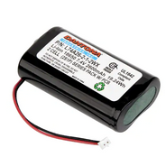

# Team 201
## EGR 314
### 2/3/23

# Humidity Sensor

**Part Name:** HIH6130-021-001

|**Solution**|**Pros**|**Cons**|
|:----------:|:--------------------:|:--------------------------------------------------:|
|<figure class="image"> </figure>|Low operating voltage|Very expensive|
|Option 1    |Footprint and schematic symbols provided|Possible long lead time|
|Board Mount Humidity Sensors I2C,5 %RH,SOIC-8 SMD NO FILTER,NON-COND|Wide range of operating temperatures||
|$18.14      |||
|[Link to data sheet](https://www.mouser.com/datasheet/2/187/HWSC_S_A0012940693_1-3073215.pdf) ||

**Part Name:** HIH6030-021-001

|**Solution**|**Pros**|**Cons**|
|:----------:|:------:|:------:|
|<figure class="image"></figure>|Low operating voltage   |Expensive |
|Option 2          |I2C compatible| Possible long lead time|
|Board Mount Humidity Sensors I2C 4.5%RH SOIC-8 SMD non-condensing|Wide range of operating temperatures|No footprint provided|
|$12.31|||
|[Link to data sheet](https://www.mouser.com/datasheet/2/187/HWSC_S_A0012940586_1-3073378.pdf)|||

**Part Name:** HIH7130-021-001

|**Solution**|**Pros**|**Cons**|
|:----------:|:------:|:------:|
|<figure class="image"> </figure>|Low Operating Voltage   |Expensive  |
|Option 3|I2C compatible|Possible long lead time|
|Board Mount Humidity Sensors SOIC 8 SMD w/o filter Non-condensing|wide range of operating temperatures|No filter|
|$13.84|Footprint providded||
|[Link to data sheet](https://www.mouser.com/datasheet/2/187/HWSC_S_A0012940383_1-3073342.pdf)|||

**Choice:** Option 1 HIH6130-021-001

**Rationale:** This SMD humidity sensor is the most expensive, but also the most reliable. It has a built-in filter to protect itself from contaminants. It has built in condensation resistance. It has a provided PCB footprint and diagram schematic. Additionally, it has a wide temperature range making it ideal for harsh environments.

# Temperature/Altitude Sensor

**Part Name:** MS561101BA03-50

|**Solution**|**Pros**|**Cons**|
|:----------:|:------:|:------:|
|<figure class="image"> </figure>|Low voltage   |Relatively expensive |
|Option 1|High accuracy for precise results|Long lead time|
|Pressure Sensor 0.15PSI ~ 17.4PSI (1kPa ~ 120kPa) Absolute 24 b 8-SMD|Wide range of working temperatures||
|$13.30|||
|[Link to data sheet](https://www.te.com/commerce/DocumentDelivery/DDEController?Action=srchrtrv&DocNm=MS5611-01BA03&DocType=Data+Sheet&DocLang=English)|||

**Part Name:** TC74A4-3.3VCTTR

|**Solution**|**Pros**|**Cons**|
|:----------:|:------:|:------:|
|<figure class="image"> </figure>|Small with space out prongs   |Greater voltage |
|Option 2|Wide range of temperatures|Long lead time|
|Temperature Sensor Digital, Local -40°C ~ 125°C 7 b SOT-23-5|I2C compatible||
|$1.09|||
|[Link to data sheet](https://www.digikey.com/en/htmldatasheets/production/48489/0/0/1/tc74.html)|||

**Part Name:** STS-30-DIS

|**Solution**|**Pros**|**Cons**|
|:----------:|:------:|:------:|
|<figure class="image"> </figure>|Wide range of temperatures   |Very close together pins |
|Option 3|Good efficiency|Not very dexcriptive data sheet|
|SENSOR DIGITAL 0C-65C 8TDFN||Potentially need higher votage|
|$2.22|||
|[Link to data sheet](https://sensirion.com/media/documents/1DA31AFD/61641F76/Sensirion_Temperature_Sensors_STS3x_Datasheet.pdf)|||

**Choice:** Option 2 TC74A4-3.3VCTTR

**Rationale:** We picked this one due to its wide range of temperatures. This allows the device to be in a variety of climates and still be able to provide alerts for the user. It also has very spaced out pins allowing it to be easier to solder without potential bridges. It also is relatively inexpensive which allows our team to order a bunch of them in case errors occur.

# LED

**Part Name:** 150060SS75000

|**Solution**|**Pros**|**Cons**|
|:----------:|:------:|:------:|
|<figure class="image"> </figure>|Easier to Wire  |Stuck to one color, limiting options  |
|Option 1|Very bright| Low quality|
|LED RED CLEAR 0603 SMD|Inexpensive|Can burn out quickly|
|$0.15|||
|[Link to data sheet](https://www.we-online.com/components/products/datasheet/150060SS75000.pdf)|||

**Part Name:** APHF1608LSEEQBDZGKC

|**Solution**|**Pros**|**Cons**|
|:----------:|:------:|:------:|
|<figure class="image"> </figure>|More diversity of color |Requires more wiring and more complicated programming  |
|Option 2|More unique and distinguishable| More difficult to replace|
|LED RGB CLEAR 4SMD||Relatively expensive|
|$0.77|||
|[Link to data sheet](https://www.kingbrightusa.com/images/catalog/SPEC/APHF1608LSEEQBDZGKC.pdf)|||

|**Solution**|**Pros**|**Cons**|
|:----------:|:------:|:------:|
|<figure class="image"> </figure>|More diversity of color |Requires more wiring and more complicated programming  |
|Option 3|Easier to Wire|Stuck to One Color which limits options|
|CV94D-FCC-CYBB0B0E0WBYABB7A363|Bulbs |Cheaply Made and can easily burn out|
|$0.44||Not very nice|
|[Link to data sheet](https://www.google.com/url?q=https://assets.cree-led.com/a/ds/h/HB-CV94D-FCC.pdf&sa=D&source=docs&ust=1682975660257214&usg=AOvVaw2pk0UqCtCOjEcSNrG5dXzH)|||

**Choice:** Option 2 APHF1608LSEEQBDZGKC
**Rationale:** It allows for more diversity of color in letting the user see ranges. We can use custom ranges, for example: setting the LED to different colors based on a sensor reading, like temperature.

# Motor Driver

**Part Name:** IFX9201SGAUMA1

|**Solution**|**Pros**|**Cons**|
|:----------:|:------:|:------:|
|<figure class="image"> </figure>|Used in class  |Needs 5v minimum supply|
|Option 1|Team has more experience with it||
|IC HALF-BRIDGE DRVR 2 CH 12DSO|2 half-bridges||
|$4.88|||
|[Link to data sheet](https://www.digikey.com/en/products/detail/infineon-technologies/IFX9201SGAUMA1/5415542)|||

**Part Name:** IFX9201SGAUMA1

|**Solution**|**Pros**|**Cons**|
|:----------:|:------:|:------:|
|<figure class="image"> </figure>|2 half bridges  |Needs 5v minimum supply|
|Option 2|Has more fault protection|Relatively expensive|
|IC DRIVER 12DSO|Made for automotive||
|$5.38|||
|[Link to data sheet](https://www.infineon.com/dgdl/Infineon-IFX9201SG-DS-v01_01-EN.pdf?fileId=5546d4624cb7f111014d2e8916795dea&ack=t)|||

**Part Name:** ATA6832C-PIQW-1

|**Solution**|**Pros**|**Cons**|
|:----------:|:------:|:------:|
|<figure class="image"> </figure>|3 half bridges  |Needs 4.5v minimum supply|
|Option 3|Multiple load types|Relatively expensive|
|IC HALF-BRIDGE DRVR SPI 18QFN|Has more fault protection|Needs a price quote before orderin(more lead time)|
|Need to get price quoted|||
|[Link to data sheet](https://ww1.microchip.com/downloads/en/DeviceDoc/Atmel-9216-Drivers-ATA6832C_Datasheet.pdf)|||

**Choice:** Option 1 IFX9201SGAUMA1

**Rationale:** We will be more familiar with this motor driver and since all our options require SPI communication and we plan to use i2c for the rest of the project, it will be very helpful to be familiar with this component before using it in the final project. Outside of familiarity, it is cheaper than the other two objects.

# Voltage Regulator

**Part Name:** MAX5033AASA+T

|**Solution**|**Pros**|**Cons**|
|:----------:|:------:|:------:|
|<figure class="image"> </figure>|Large temperature range(-40C to +125C)|Relatively expensive|
|Option 1|High efficiency under intended operating conditions(<80%)|Efficiency is reduced due to our intended Vin(7.5v)|
|C REG BUCK 3.3V 500MA 8SOIC|Low quiescent current draw(~270 uA)|Only 500 mA output|
|$3.87|||
|[Link to data sheet](https://www.analog.com/media/en/technical-documentation/data-sheets/max5033.pdf)|||

**Part Name:** ADP1110AR-3.3

|**Solution**|**Pros**|**Cons**|
|:----------:|:------:|:------:|
|<figure class="image"> </figure>|Outputs required current|Modularity means more connections required for configuring in step-down mode|
|Option 2|Configurable for battery indicator|Lower temperature operating range than other options|
|UPWR, STEP-UP/DOWN SWITCHING REG|Relatively inexpensive|Requires difficult to source 1N5818 diode(Potentially viable with 1N5819 diode)|
|$0.53|Expansive data sheet||
|[Link to data sheet](https://rocelec.widen.net/view/pdf/qvisxtjgqu/ANDIS03974-1.pdf?t.download=true&u=5oefqw)|||

**Part Name:** L6981N33DR

|**Solution**|**Pros**|**Cons**|
|:----------:|:------:|:------:|
|<figure class="image"> </figure>|Greatest max current output|Lower max soldering temperature|
|Option 3|Low noise and low consumption version available for light load|Relatively expensive|
|IC REG BUCK 3.3V 1.5A 8SO|High values for reverse voltage and current protection||
|$3.02|Large temperature operating range||
|[Link to data sheet](https://www.st.com/content/ccc/resource/technical/document/datasheet/group3/6f/60/06/44/3f/c5/43/f7/DM00747618/files/DM00747618.pdf/jcr:content/translations/en.DM00747618.pdf)|||

**Choice:** Option 3: L6981N33DR

**Rationale:** This voltage regulator features the highest Imax out of the other options, while featuring an extremely expansive and detailed datasheet. The listed application circuits, expected scope outputs and operating characteristics will easily allow the team to understand when the device is not operating correctly. The two operation modes will allow us to tailor the regulator circuit to the needs of the rest of our embedded system. 

# 7.4v Battery Pack

**Part Name:** L74A52-4-3-2WX

|**Solution**|**Pros**|**Cons**|
|:----------:|:--------------------:|:--------------------------------------------------:|
|<figure class="image"> </figure>|High mAh|Relatively expensive|
|Option 1    |Short lead time||
|BATTERY PACK LI-ION 7.4V 18650|||
|$26.44|||
|[Link to data sheet](https://dantona.com/l74a52-4-3-2wx) ||

**Part Name:** L74A26-2-1-2WX

|**Solution**|**Pros**|**Cons**|
|:----------:|:------:|:------:|
|<figure class="image"> </figure>|Relatively small footprint|Relatively Expensive |
|Option 2          |Short lead time||
|BATTERY PACK LI-ION 7.4V 18650|||
|$17.87|||
|[Link to data sheet](https://dantona.com/l74a26-2-1-2wx)|||

**Part Name:** L74A52-4-10-2WX

|**Solution**|**Pros**|**Cons**|
|:----------:|:------:|:------:|
|<figure class="image"> </figure>|High mAh   |Expensive  |
|Option 3|Short lead time|Bulky|
|BATTERY PACK LI-ION 7.4V 18650|||
|$26.44|Footprint providded||
|[Link to data sheet](https://dantona.com/l74a52-4-10-2wx)|||

**Choice:** Option 2 7.4v Battery Pack: L74A26-2-1-2WX

**Rationale:** It is the cheaper and most compact option. It has enough mAh for our needs, and we have proven it has worked to power our selected motor in the past.

# Motor

**Part Name:** MOT-KM NJSC-12-A

|**Solution**|**Pros**|**Cons**|
|:----------:|:--------------------:|:--------------------------------------------------:|
|<figure class="image"> </figure>|High mAh|Relatively expensive|
|Option 1    |Short lead time||
|12MM SPUR GEAR MOTOR - BRUSHED,|||
|$18.75|||
|[Link to data sheet](https://media.digikey.com/pdf/Data%20Sheets/ISL%20PDFs/MOT-KM%20NJSC-12-A.pdf) ||

**Part Name:** PPN7PA12C1

|**Solution**|**Pros**|**Cons**|
|:----------:|:------:|:------:|
|<figure class="image"> </figure>|Inexpensive to replace|Low torque|
|Option 2          |Small|Hard to attach an axle|
|STANDARD MOTOR 11605 RPM 5V|High RPM||
|$3.34|Lightweight||
|[Link to data sheet](https://media.digikey.com/pdf/Data%20Sheets/NMB-MAT/ppn7pa12c1%20data%20sheet.pdf)|||

**Part Name:** SE10JOVTM

|**Solution**|**Pros**|**Cons**|
|:----------:|:------:|:------:|
|<figure class="image"> </figure>|Extremely small   |Can only be ordered in quantities of 25|
|Option 3|Well balanced between RPM and torque|made to order|
|STANDARD MOTOR 7000 RPM 5V|Lightweight|Expensive|
|$34.72|Footprint providded||
|[Link to data sheet](https://media.digikey.com/pdf/Data%20Sheets/NMB-MAT/SE10J.pdf)|||

**Choice:** Option 1 MOT-KM NJSC-12-A DC brushed motor

**Rationale:** The MOT-KM NJSC-12-A DC brushed motor is more expensive, but it is small enough to fit multiple in a small frame, and is lightweight, preventing the robot from becoming too heavy. It has high torque due to the gearbox and has a lower rated current draw compared to the other two.

