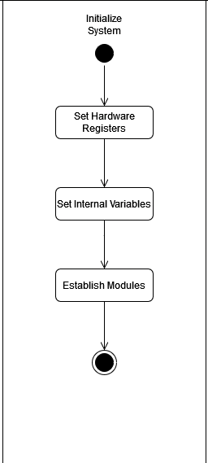
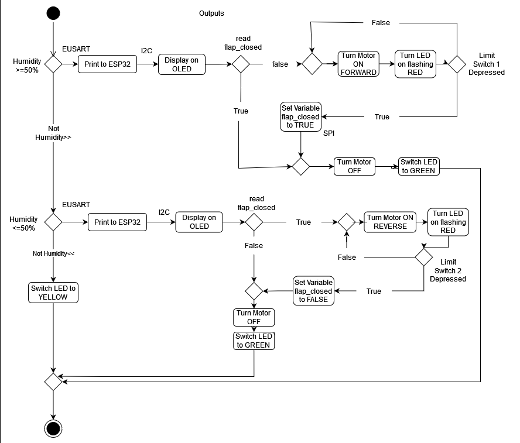

# Software Proposal

## Full Diagram

<figure class="image">  

  

   

</figure>

## Main Loop

<figure class="image">  

  

   

</figure>

## Sensor Reading Loop

<figure class="image">  

  

   

</figure>

## Initialize Loop

<figure class="image">  

  

   

</figure>

## Humidity Sensor Loop

<figure class="image">  

  

   

</figure>

## Temperature Sensor Loop

<figure class="image">  

  

   

</figure>

## OLED Display Loop

<figure class="image">  

  

   

</figure>

## Outputs Loop

<figure class="image">  

  

   

</figure>
