<p align="center"><strong>ARIZONA STATE UNIVERSITY</strong></p>

<p align="center"><strong>ENGINEERING 314 - DANIEL AUKES</strong></p>
  
<p align="center"><strong>Weather Based Device Project</strong></p>

<p align="center"><strong>Team 201</strong></p>

<p align="center"><strong>Aiden Lynch, Finnton Wentworth, Richard Kovalcik, Glen Stevens</strong></p>

<p align="center"><strong>Submission Date: 5/1/2023</strong></p>

## Table of Contents

[Introduction](https://egr314-team201.github.io/report/#introduction)

[Team Organization](https://egr314-team201.github.io/report/#team-organization)

[User Needs](https://egr314-team201.github.io/report/#user-needs)

[Design Ideation](https://egr314-team201.github.io/report/#design-ideation)

[Selected Design](https://egr314-team201.github.io/report/#selected-design)

[Block Diagram](https://egr314-team201.github.io/report/#block-diagram)

[Microcontroller Selection](https://egr314-team201.github.io/report/#microcontroller-selection)

[Component Selection](https://egr314-team201.github.io/report/#component-selection)

[Hardware Implementation](https://egr314-team201.github.io/report/#hardware-implementation)

[Software Implementation](https://egr314-team201.github.io/report/#software-implementation)

[System Verification](https://egr314-team201.github.io/report/#system-verification)

[Lessons Learned](https://egr314-team201.github.io/report/#lessons-learned)

[Reccomedations for Future Students](https://egr314-team201.github.io/report/#recomendations-for-future-egr314-students)

[Appendices](https://egr314-team201.github.io/report/#appendix-a-team-organization)


## Introduction

Our team seeks to design a weather data collection device able to collect a variety of weather-related data such as temperature, humidity, atmospheric pressure, and wind speed through the use of surface mount sensors utilizing a variety of communication protocols. Throughout the semester we will be custom-creating a schematic and a PCB and having it manufactured. We will be using programs such as Cadence and Github to create our deliverables. The completed deliverable will be presented at the innovation showcase to a variety of industry representatives.

## Team Organization:

The following sections will only cover the Team Charter and Mission Statement. The rest of the Team Organization can be found in [**Appendix A: Team Organization Assignment**](https://egr314-team201.github.io/Assignments/TeamOrganization/)

**Team Charter:**

Shortly after we assembled our team and got to know one another better we decided to come up with our team charter. In this session, we decided to start talking about the initial goals and ideas for this project. We wanted to be able to determine our metrics of success to which we could come back to at the end of the semester and see if we achieved our goals. We each discussed our goals and noticed a lot of similarities between our ideals for this project. After careful consideration, we decided upon the following team charter.

_“With the presentation of our projects at the Innovation Showcase, our team is looking to create a professional deliverable that has a strong visual appeal to judges. We hope to develop strong skills in tools used by engineers currently in the workforce, such as GitHub, Cadence, and the various other software that will be utilized in this class, and to display our accomplishments using these tools in a clear way. By creating a product that is thoughtfully designed, we hope to hone our abilities as engineers and demonstrate our capabilities to industry members at the innovation showcase.”_

**Mission Statement:**

After we did the Charter, we decided to move on to the mission statement and decide our primary goal for this project. We took some of our ideas from the Team Charter and attempted to condense them into a singular statement. A problem we ran into was that we were not fully aware of what the scope of the final project would be so made some assumptions, based on project requirements and initial design ideas. After using the provided references we decided on the following mission statement:

_“To create an effective product that will accurately and quickly collect weather-based data.”_

## User Needs:

Viewing market options in weather sensor equipment allowed our team to perform benchmarking for our project concepts and generate user needs by analyzing real product reviews. Our team looked at five different available commercial solutions generated from Amazon searches and their product reviews to generate a list of needs from the customer’s own words. Both positive and negative reviews were viewed to determine what features in a weather sensor were desired and what should be cut or was missing from most products. 

**Need Generation and Sorting:**

Reading user reviews with the perspective of generating project features was most important to us. Since the scope of the project was fairly undefined with the exception of budget and the overarching requirements listed for the course, the team viewed amazon reviews, looking for requested features, as well as what the users viewed as extraneous on the products we reviewed. Looking for explicitly listed needs, as well as digging deeper into the wording of the reviews to see latent needs from the users. From these reviews, we generated a list of 103 needs, as seen in **Figure A**. 

<figure class="image">  

<div style="text-align: center">  

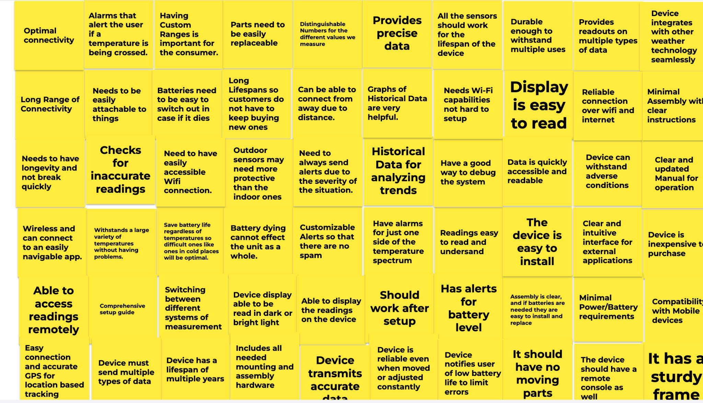<br>  

</div>

</figure>

<figure class="image">  

<div style="text-align: center">  

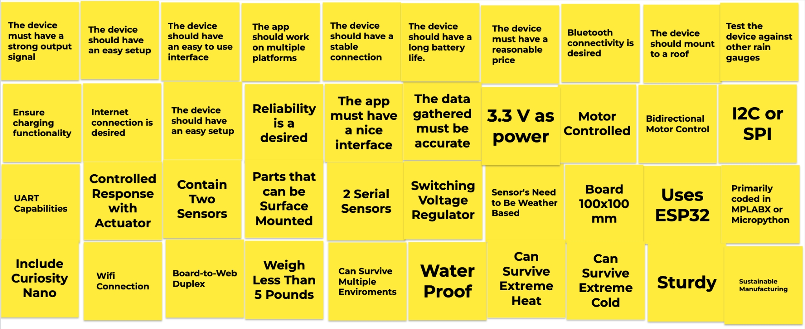<br>  

</div>

</figure>

<p align="center">Figure A: Full list of Generated Needs</p>

From this full list, we sorted these needs into six different categories: Hardware, Software, Interactivity/User Experience, Customization, Manufacturing, and Safety. These categories were chosen based on the aspect sections we included in our Product Requirements Document which was written following the review of our sorted user needs. Shown below in **Figure B** is our sorted list for the Hardware section, and the full list of sorted needs can be found in Appendix B: User Needs and Benchmarking. 	

<figure class="image">  

<div style="text-align: center">  

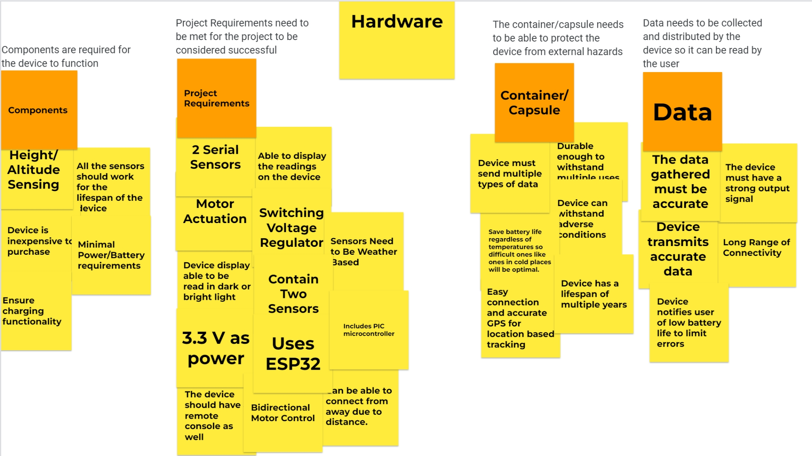<br>  

</div>

</figure>

<p align="center">Figure B: Hardware category of sorted user needs</p>
  
From these sorted needs, our team ranked the needs into three separate weights, with one to three stars denoting importance. The weight of a specific need was chosen by our team, with the greatest ranking given to needs that were generated from project requirements and effective functionality, as these were non-negotiable features for our final deliverable. Without including the three star needs, our project would fail to meet stated requirements or would lack qualities that would make it a functional or usable product. Below in **Figure C** is the evolution of the Hardware section, now ranked. 

<figure class="image">  

<div style="text-align: center">  

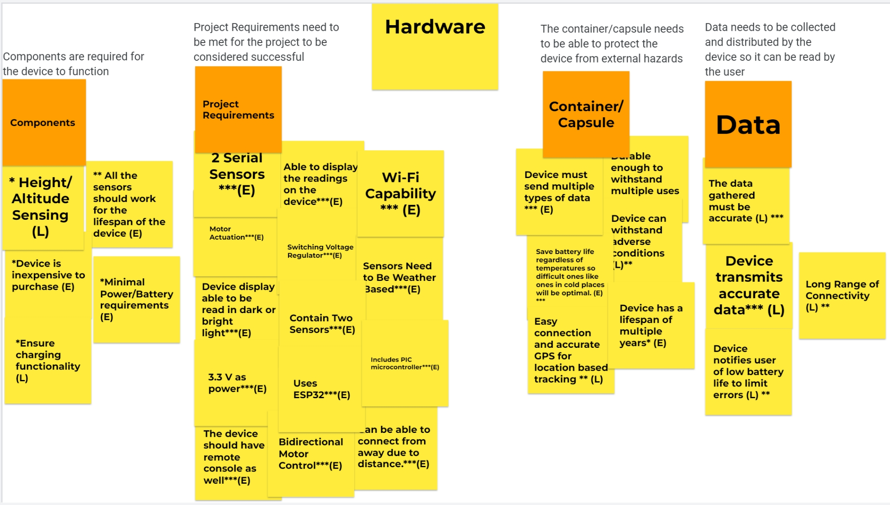<br>  

</div>

</figure>

<p align="center">Figure C: Ranked List of Hardware Needs</p>

The full assignment can be found in [**Appendix B User Needs and Benchmarking**](https://egr314-team201.github.io/Assignments/User-Needs/)

Now with our generated list of user needs sorted and ranked, our team looked to characterize and formalize the project and needs through the construction of a Project Requirements Document, which would provide the background, objectives, and potential stakeholder experiences with our project. Although we felt that our main stakeholders ranged from Industry members to hobbyists, we chose to imagine the project’s use from the perspective of a field engineer as well as a student for our use case scenarios. 
  
Our list of sorted needs were kept in their sorted categories for the PRD, and converted to project aspects for reviewing final project success. These were given priorities based on the weight assigned to them during the ranking process, although since the scale ranged from P1-P10 instead of 1-3 stars, we were able to create more depth within our aspect ranking. 
  
The full PRD can be found in [**Appendix C: Project Requirements Document**](https://egr314-team201.github.io/Assignments/Product-Requirements/)

Overall the User Needs taught us alot about what we should prioritize during the future steps of the project. We learned that portability was a very important feature that many users want with their product. However, on that same spectrum, the device needs to be stable enough to not constantly move around on a windy day. Another important feature that was a common want throughout the reviews was that they wanted to be able to see everything on their phone. Whether that be trends, battery status, or the current status of what is happening users want that information to be easily accessible. These are all very important aspects we are going to make sure are included when our team goes into the development phase.


## Design Ideation:

**Idea Generation:**

We initiated our design ideation by generating one hundred design ideas. These ideas can be viewed below in **Figure D.**

<figure class="image">  

<div style="text-align: center">  

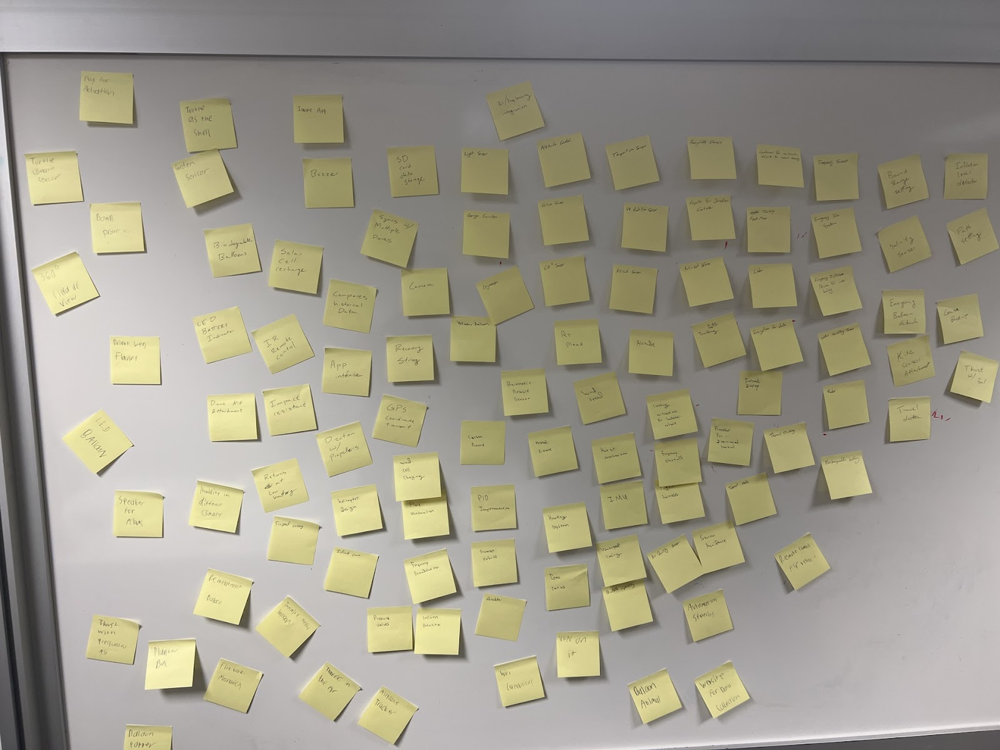<br>  

</div>

</figure>
  
Idea Sortation and Ranking:
Once we had generated our 100 design ideas, we proceeded to sort them into three categories. These categories being miscellaneous, weather balloon, and drone which can be viewed respectively in **Figure E**, **Figure F**, and **Figure G**. After this process, we ranked our ideas vertically from the most to least practical. A few of the aspects we looked for in practicality were ease of implementation, feasibility, and requirement satisfaction. 

<figure class="image">  

<div style="text-align: center">  

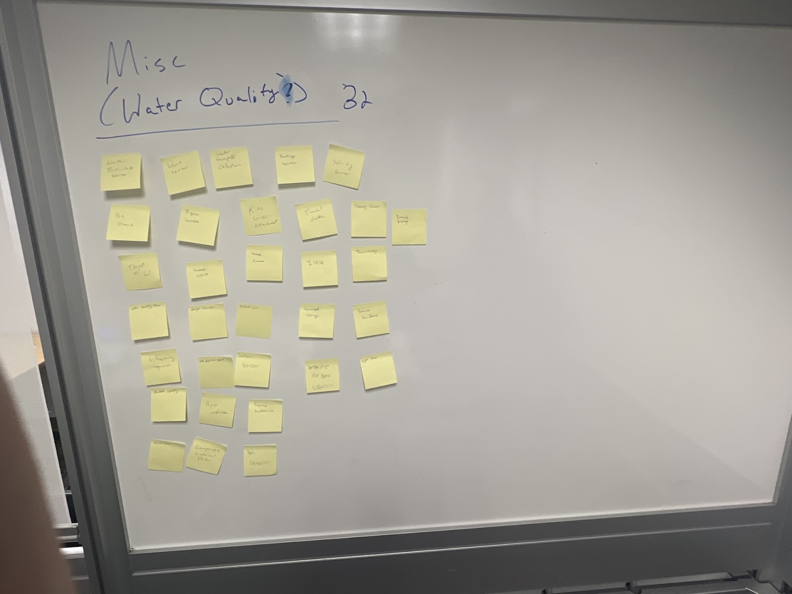<br>  

</div>

</figure>

<p align="center">Figure E: Miscellaneous</p>

  
<figure class="image">  

<div style="text-align: center">  

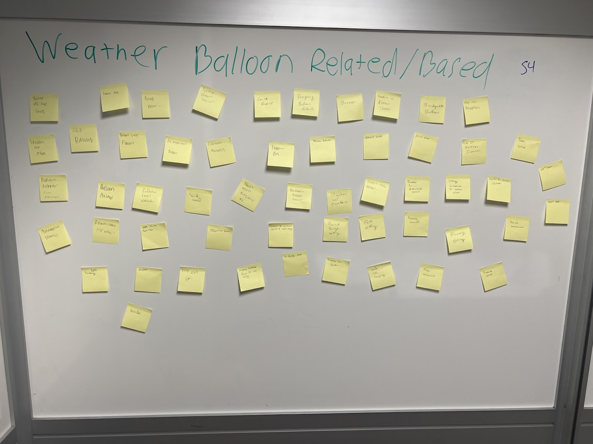<br>  

</div>

</figure>
  
<p align="center">Figure F: Weather Balloon</p>
  
<figure class="image">  

<div style="text-align: center">  

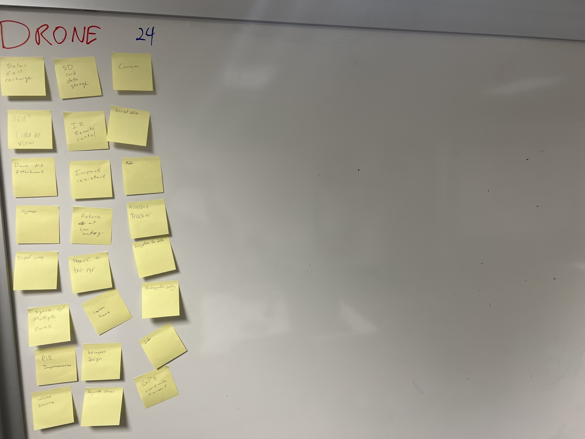<br>  

</div>

</figure>

<p align="center">Figure G: Drone</p>


**Concept 1: Weather Balloon**

Aiden Lynch was in charge of the Weather Balloon design concept. The fundamental idea is that we have a system attached to a balloon that will be able to sense multiple different environmental factors at different altitudes. See **Figure H** below for the picture of the figure and for a description of the device.

<figure class="image">  

<div style="text-align: center">  

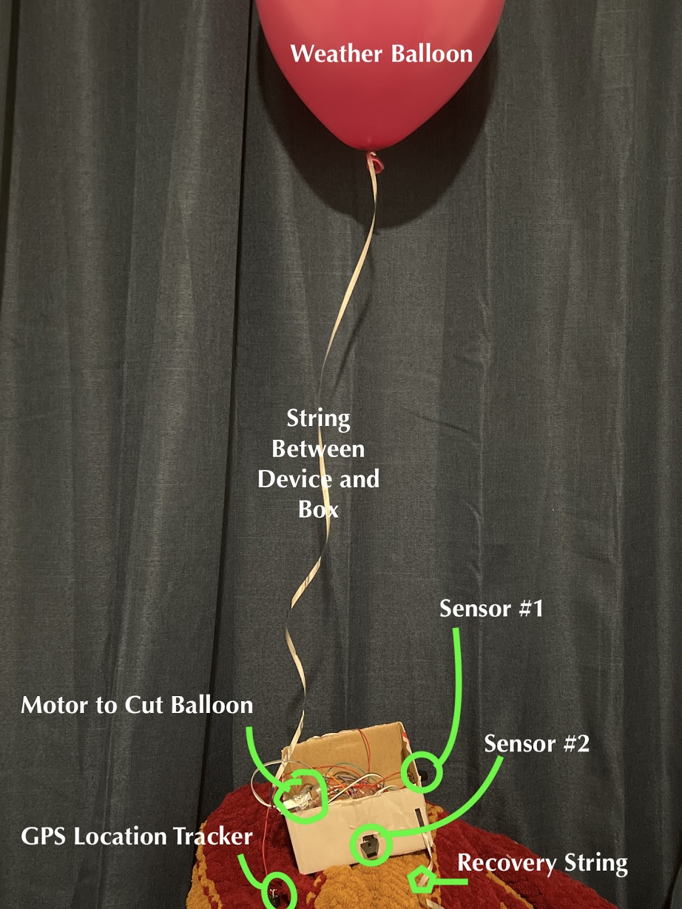<br>  

</div>

</figure>

<p align="center">Figure H: Weather Balloon</p>

We have the balloon that will raise the device up in the sky to collect readings. We are discussing whether to use an actual weather balloon, a helium balloon, or a biodegradable balloon to limit waste. We have a strong string/rope that will connect the balloon to the top of the box whether it be on a hook or another method with a closed top. We have two currently undefined weather-based sensors that will be connected to the PCB inside of the unit inside the box. Connected to the top we have a bidirectional motor that will be the actuation and will be in charge of cutting the rope to bring the device back for the users. We also have attached a GPS tracker that will be utilized through wifi to allow us to receive the readings while also being able to track the balloon. Some benefits is that we can use the string at the bottom to accurately measure a variety of different heights by increasing the sting length. Another pro is that it is a very visually appealing project and very easy to understand the fundamental idea of how it works. The biggest con we believe is retrieval of the box if it gets too high and the non-wasting of balloons during testing.

**Concept 2: Water Buoy**

Finnton Wentworth visualized concept #2, a floating water based sensor array. The device would be able to collect a physical sample of water as well as transmitting various environmental data. 

<figure class="image">  

<div style="text-align: center">  

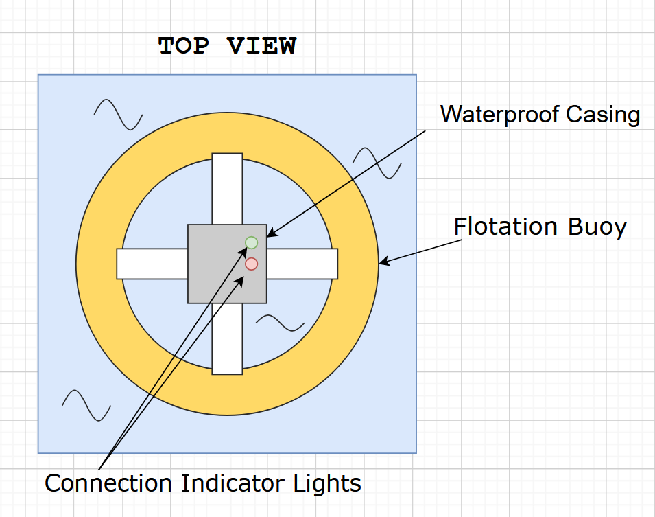<br>  

</div>

</figure>

<figure class="image">  

<div style="text-align: center">  

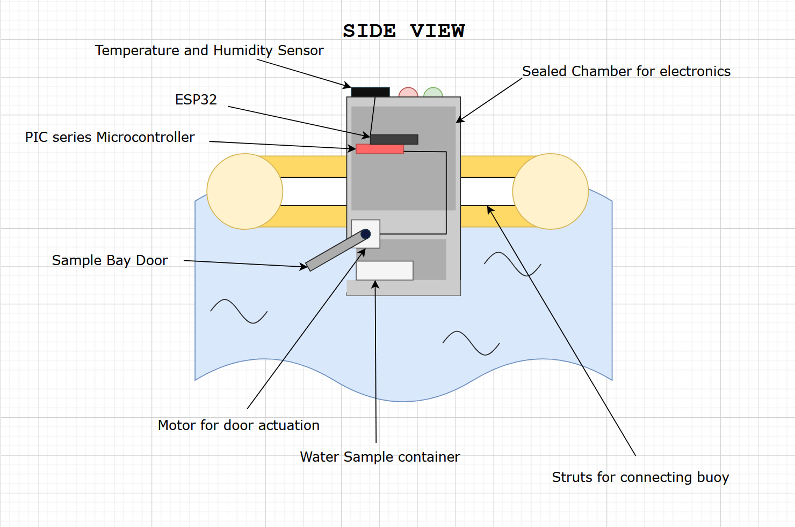<br>  

</div>

</figure>

<p align="center">Figure I: Water Buoy </p>

Design concept #2 looks to act as a deployable water quality and condition sensor. The user would place the buoy in a body of water to collect and transmit data based on the attached sensors. The main point of actuation is in a sample collection bay door, which sits under the surface of the water. Once the door closes, the water sample can be collected later when the device is retrieved for lab analysis.

The microcontroller and batteries will be stored in a sealed chamber within the main housing of the device, with wires running out connecting to the motor, lights, and external sensors, and sealed to prevent water from damaging the electronics. The body of the device will be constructed from some waterproof material, most likely printed PLA. One major risk of this design is damage to the sensitive components due to moisture or water. Some inexpensive moisture control strategies would be including silica gel packets within the electronics housing. 

**Concept 3: Drone**

Glen Stevens was in charge of the Drone kit design concept. The idea was to create a kit that could be attached to a drone that would then read weather conditions as the drone flew around. See **Figure J** below for a model of the concept.

<figure class="image">  

<div style="text-align: center">  

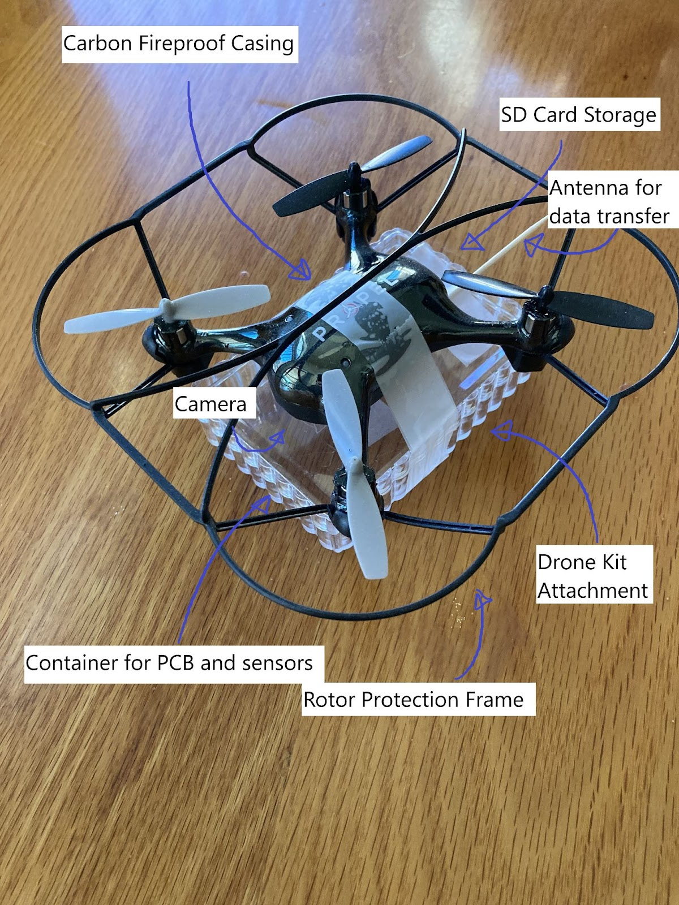<br>  

</div>

</figure>

<p align="center">Figure J: Drone Kit</p>

The idea for the drone is to take advantage of a drone’s capabilities to reach different altitudes quickly and be programmed to take a certain flight path. We would attach numerous sensors to the drone and try to upgrade its chassis and casing if need be. It would be collecting data from these sensors and storing them on an SD card and then transferring them over wifi once it can connect.

The main concepts are shown in the image, but some could not be included due to them being internal components. These include a rechargeable battery, a way to track the drone using GPS, some form of collision detection, implementing PID control from the rotors, implementing Lidar to try and prevent collisions, the ability to sync with multiple drones, on-board encryption for the data(specifically the GPS data), a way to prevent the drone from accidentally flying into restricted airspace, returning to base in case of a low battery, a gyroscope for stability, and a way to remotely control the drone.

An example of usage would be wanting to track weather patterns in an area throughout a day. A user would set a flight path for the drone or even use a pre-programmed flight path (such as a grid pattern or a figure eight) and it would collect data throughout the day, autonomously returning to recharge and transfer any data it had collected. The user could change the height it operates at, to check weather patterns closer to the ground or higher up.

The wide range of design concepts we discussed and ideated as a team looked to address the open nature of the user needs we generated. Since the generated user needs asked for clear, accurate information collection from their device, we looked to provide products that would provide data collection in a variety of environments before deciding on a project direction. By exploring options in field deployable weather devices in a variety of environments, our team explored the possibilities of various sensor arrays that would stay within design requirements. The generated concepts, however, provided design difficulties our team was worried about addressing.


## Selected Design:

After our Checkpoint 1 presentation we decided to sit down and really evaluate how we were going to implement our project. We were at the time very confident that we were going to end up doing the Weather Balloon Idea. However, when we sat down and decided to implement the idea, the concept of the Balloon Budget and the safety of the device became fundamental problems that rendered our idea unusable. We could not ensure the protection of the device with our budget. After that revelation, we decided we had to rework our idea. We took the original idea that was the base of the balloon and then decided to make that a stationary object. Once we decided that the possibilities of what we could design expanded drastically. After many looks at our User Needs, Project Requirements Document, and our Ideas, we came up with the idea in **Figure K**

<figure class="image">  

<div style="text-align: center">  

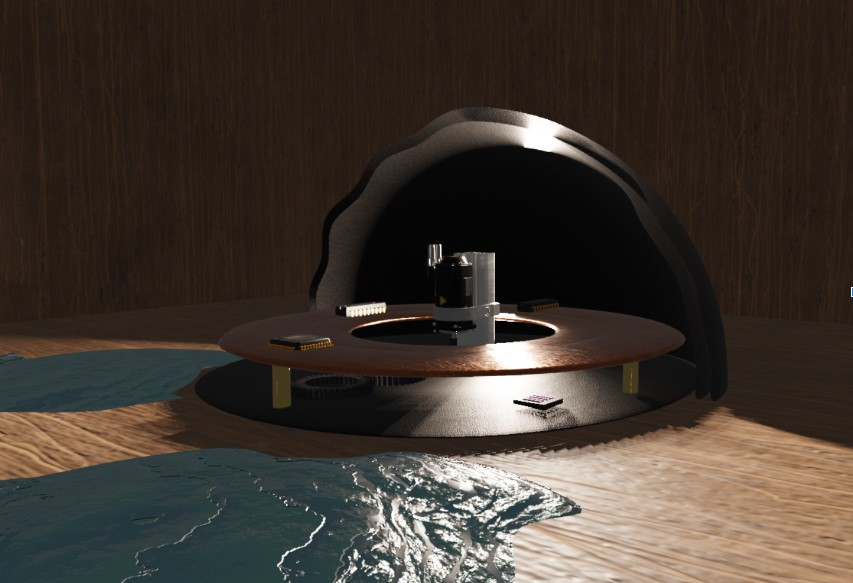<br>  

</div>

</figure>

<p align="center">Figure K: Selected Design Idea</p>

With this idea, we have all of our sensors on the elevated layer that collects the readings. When the humidity or temperature reaches a certain value, the motor in the center turns the dome so it is a completely sealed area and prevents any future damage to the device. The idea would be that this would be a stationary dome that would sit by a specific area and give constant readings about temperature and humidity. 

Througout the following weeks we learned more about what we could and could not do with our design. We managed to have a similar idea with a revolving
dome that would allow for protection from the outside environment. To acheive this we settled on a box capable of containing the PCB and a dome capable of protecting the hardware. The box containing the PCB was equipped with holes for mounting the push button, and wire management. Additionally, we included spacers on the bottom of the box to prevent the microchip from rubbing on the design. As for the dome, we settled on a friction fit attachment to the motor shaft so we could easily demonstrate and present of PCB design during the innovation showcase. Both of the components were printed using a resin printer with a fixed layer height of 0.05mm. One future idea would be to implement a flap instead of a revolving dome to decrease the overall footprint of the device.   

After many prototypes we came up with our final selected design which can be seen in **Figure L**

<figure class="image">  

<div style="text-align: center">  

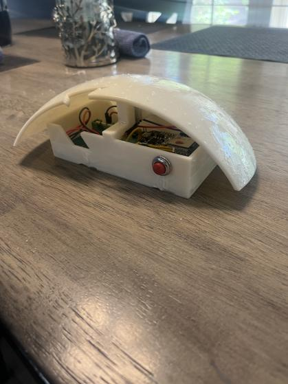<br>  

</div>

</figure>

<p align="center">Figure L: Final Design</p>

In the following sections, we will be going into more depth on the specifics of our design.

## Block Diagram:

After we decided on our idea we needed to determine the subsystems and how the idea will operate as a whole. To do this we looked at the individual parts we determined we needed to make this work and split them up. While we did this we referenced the project requirements as well and made sure every part fit the project requirements. The full block diagram which is in **Figure M** has been constantly updated during our project to showcase the most current version.

<figure class="image">  

<div style="text-align: center">  

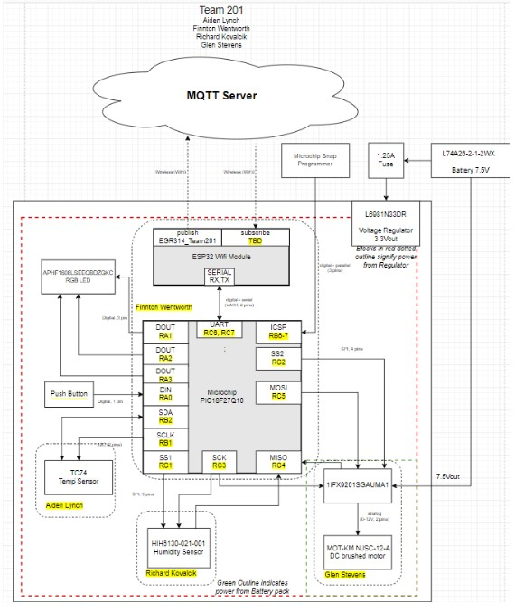<br>  

</div>

</figure>

<p align="center">Figure M: Block Diagram</p>

On the block diagram, we have the Temperature and Humidity sensors that both utilize I2C which fulfill the sensor requirements. We have a motor driver that has bidirectional capability and uses SPI which fulfills the Actuation Requirements. We also have UART communication to the ESP32 module which is also how we will transmit over Wifi. Then we also have the microcontroller that will control the entire system that we picked in the Component Selection part of the process. Each pin of the microcontroller that will be used is described on the diagram, with the specific pin and functionality, from clock pins to digital outputs. We also have a button that serves as a reset button that when pressed will send the device back to default mode. We also have an RGB Led which makes a fun little indicator. This feature is not a part of the project requirements but is there to enhance the experience and provide additional information to the user about the state of the device. The full Block Diagram is located in [**Appendix D: Block Diagram**](https://egr314-team201.github.io/Assignments/block-diagram/)

## Microcontroller Selection:

Choosing a microcontroller that could meet the demands of the variety of subsystems described in the team’s block diagram was essential to the success of the project. Without a capable microcontroller, none of the sensors and motors could work in tandem to create a cohesive embedded system. To ensure that the proper PIC series microcontroller was selected for our final design, we developed a list of requirements for our candidate microcontrollers. These included: 

1. 2 dedicated I2C and SPI peripherals, either standalone or through Master Synchronous Serial Port (MSSP)
 
2. 14 GPIO pins bare minimum, with extras for flexibility in our design

3. 1 UART communication port, bare minimum, for interfacing with the ESP32

Our team also decided on additional peripherals that would permit for greater flexibility in our design in the case of last minute changes due to unforeseen difficulties. 

1. 1 Analog-to-Digital Converter (ADC) and 1 Digital-to-Analog (DAC) for design flexibility

2. 1 PWM output for additional motor driving capabilities

3. A second UART channel for interfacing with an external PC without interrupting UART communications between the PIC and the MCU

4. Expansive internal memory for allowing for large program sizes 

These factors influenced our choice, along with the stated course project requirements, and our team settled on the PIC18F27Q10, shown below in **Figure N**, in the SOIC package form.

<figure class="image">  

<div style="text-align: center">  

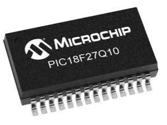<br>  

</div>

</figure>


<p align="center">Figure N: PIC18F27Q10 MCU, SOIC package</p>

This IC met all constraints and further criteria our team established, with two MSSP ports, two UART channels, and enough GPIO pins to drive all external peripherals our design demanded. One major advantage of this MCU over other options is its ease of implementation with the existing work our team has accomplished in the course using the Curiosity Nano Development board, which features the PIC18F47Q10, in the same device family as our selected microcontroller.  The two MCUs feature the exact same set of peripherals, differing only in total pin count and ADC channels. The reduction in ADC channels is irrelevant to our design, and by reducing the total pin count, we also reduce the footprint of our chip on our final PCB. Choosing this microcontroller allows for seamless integration of code already written by our team during homeworks, ICCs, and labs, while reducing the unneeded features from the PIC18F47Q10 Curiosity Nano development board. Since the datasheet of this MCU is the same as the microcontroller used in class, our team is already familiar with navigating the datasheet for examples and pinouts. This makes the PIC18F27Q10 a compelling choice for serving as the main brain of our sensor array. The full comparison of the PIC18F27Q10 between two other alternatives, the PIC18F45Q10 and the PIC16F15376, can be found in [**Appendix E: Microcontroller Selection**](https://egr314-team201.github.io/Assignments/microcontroller-selection/)

## Component Selection:

After we determined what subsystems we wanted to do and how the product was going to work, we then had to decide what parts we were going to use. We as a team met up and talked about the criteria we were all going to follow while selecting our parts. After looking at product requirements and our own personal opinions we decided on the following general requirements:

1. Must contain a thorough Datasheet

2. Must be Surface Mount

3. Total Subsystem needs to be under $60 Dollars

4. Must be able to ship immediately 

After we determined these general requirements we each went to research our own subsystem. Below we have the 6 most critical parts of our subsystem and our rationale behind why we chose them. The Full Assignment can be found in [**Appendix F: Component Selection**](https://egr314-team201.github.io/Assignments/component-selection/)

<figure class="image">  

<div style="text-align: center">  

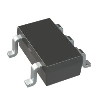<br>  

</div>

</figure>

<p align="center">Figure O: TC74A4-3.3VCTTR</p>

We ultimately decided on this sensor in **Figure O** due to its large range of temperatures. This allows the user to take this product with them to whichever climate they go to and still be able to utilize it. Another aspect we enjoyed about the product was how spaced out the pins were which would make it easier to solder without accidentally bridging the component. It was also very inexpensive which allowed us to order many in case of a problem with a sensor. This component also greatly fits every component requirement we created at the start.

**Humidity Sensor:**

<figure class="image">  

<div style="text-align: center">  

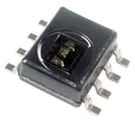<br>  

</div>

</figure>


<p align="center">Figure P: HIH6130-021-001</p>

We ultimately decided on the sensor in **Figure P** due to its reliability. The chip comes with many useful additions. It contains a built-in filter that protects the sensor from any contaminants which is very useful in a place such as a closet where dust can commonly be found. It also has a built-in condensation resistance which will be very useful for not having to replace the sensor which is an important feature to our users. It also can survive in a large number of climates and fits all of our predetermined general requirements.

**Motor Driver:**

<figure class="image">  

<div style="text-align: center">  

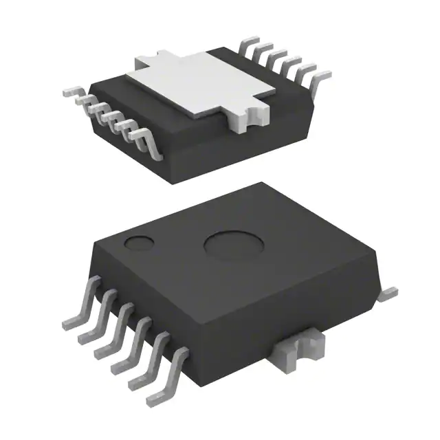<br>  

</div>

</figure>

<p align="center">Figure Q: 1IFX9201SGAUMA1</p>

We decided to use the same motor driver as we used in a previous assignment due to having prior experience using it and its SPI capabilities. This motor driver only has one half-bridge, but that is sufficient for our purposes as we are only using one motor to actuate the dome. Due to its lower cost than the other motor drivers, we were able to order extras in case we damage it.

**Motors:**

<figure class="image">  

<div style="text-align: center">  

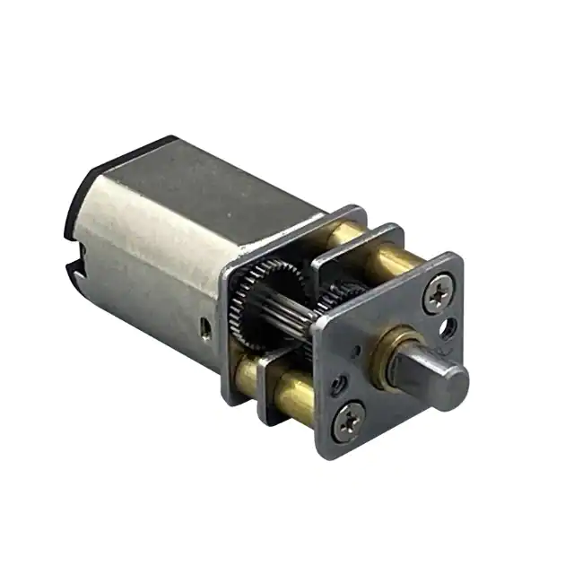<br>  

</div>

</figure>

<p align="center">Figure R: MOT-KM NJSC-12-A DC brushed motor</p>

We used this motor because we already have it. It uses 5v, which we can supply separately from the battery. It has high torque and rotates relatively slowly, allowing us to control the actuation with less danger of burning out the motor or damaged the dome.


**Voltage Regulator:**

<figure class="image">  

<div style="text-align: center">  

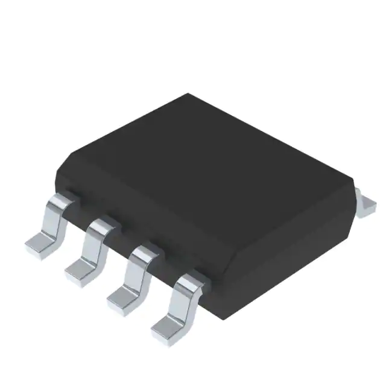<br>  

</div>

</figure>

<p align="center">Figure S: L6981N33DR</p>


The L6981N33DR, shown in **Figure S,** was chosen due the excellent maximum current output and expansive datasheet, which was complete with application schematics and performance diagrams. It also features two possible operation modes that allowed our team to tailor the device to our needs during the subsystem design portion of the project. From our power budget, we confirmed that the 1.5 amp max output of this device would be plenty for our subsystem’s demands. 

The Final Bill of Materials can be Found in [**Appendix G: Bill of Materials**](https://egr314-team201.github.io/Assignments/Bill-of-Materials/)

**Power Budget:**

After we chose all of our components we needed to make sure that they fit the power constraints that we were assigned at the beginning of the project. Our final power budget is listed below in **Figure T.**

<figure class="image">  

<div style="text-align: center">  

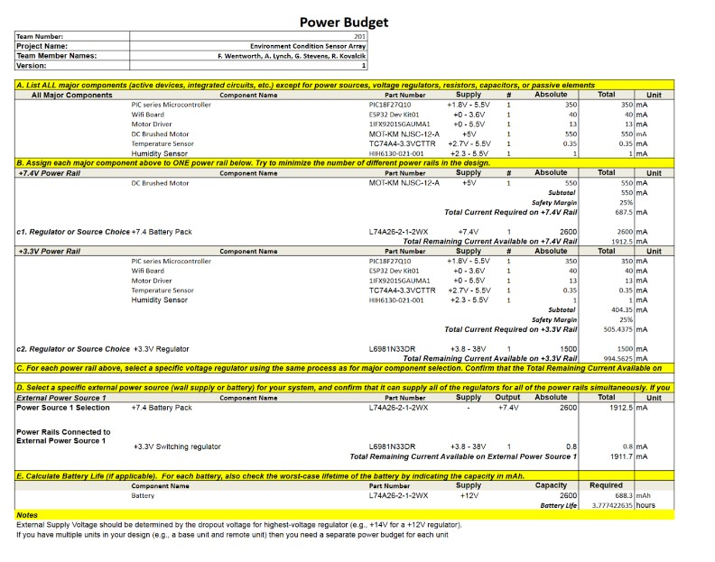<br>  

</div>

</figure>

<p align="center">Figure T: Power Budget</p>

Listed within the power budget is a breakdown of voltage and current demands that our various sensors, motors, and drivers require. Fortunately, our design only requires two separate power rails, a positive 7.4-volt rail for driving our motor and feeding into the voltage regulator, and a positive 3.3-volt rail for all other circuitry from the regulator output. With this, our largest current demand comes from our motor, which at max will sink 550 mA during a stall. One challenge that our design poses are the need to drive a motor from a battery power supply, which has the potential to drain the battery quickly. Because of this, we chose a battery pack with a large amp hour rating and tested that the motor can be driven continuously using this supply. If we need to make the change to a wall supply, our design features a barrel jack connector that will allow us to switch easily. The full Power budget can be found in [**Appendix H: Power Budget**](https://egr314-team201.github.io/Assignments/power-budget/)

## Hardware Implementation:

After we selected our components we then were able to create the schematic for our final design. To do this we each decided to take our individual subsystems and design those first. We utilized the datasheets and the lessons from our Engineering 304 and 314 classes. After we had an idea of what our final subsystem circuit would look like we decided to verify them on some custom PCBs. To start we designed our subsystem schematic in Cadence’s Capture CIS. While designing we had to create custom symbols and PCB Footprints to represent the parts that we picked during Component Selection. Almost every single component listed in Component Selection needed a custom footprint which we have in a shared folder that will be for the Hardware Proposal and the Final Hardware Implementation. While we were designing we also included the ESP32 and the OLED screen which fulfilled the last 2 parts of the Project Requirements that have not been mentioned. After that was all sorted we designed our individual PCBs in Cadence’s PCB Editor and sent them to manufacturing. The Microcontroller individual subsystem which was created by Finnton Wentworth is shown in **Figure U** and **Figure V.**

<figure class="image">  

<div style="text-align: center">  

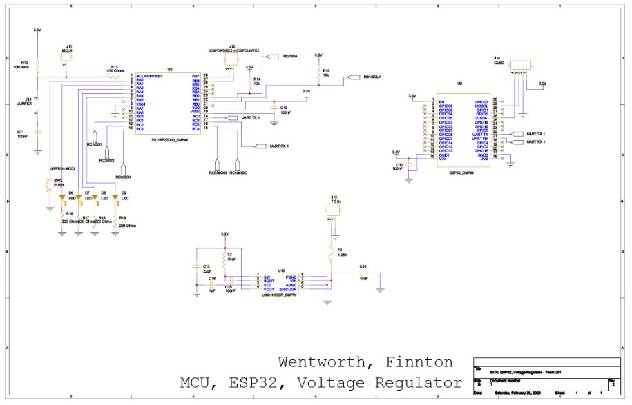<br>  

</div>

</figure>

<p align="center">Figure U: Microcontroller Schematic</p>


<figure class="image">  

<div style="text-align: center">  

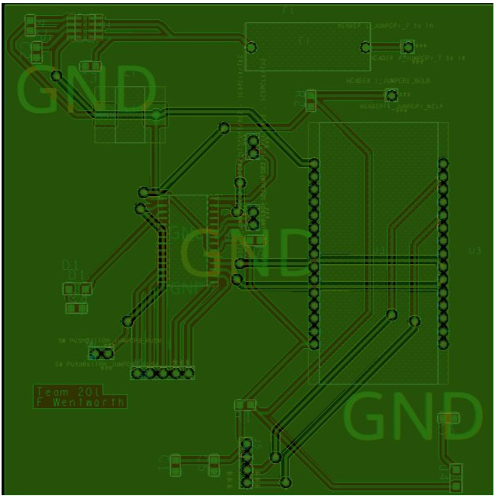<br>  

</div>

</figure>

<p align="center">Figure V: Microcontroller PCB</p>

After the PCBs were printed we populated them with the components that we ordered in Component Selection. Once we verified that they all worked as intended we met up together and decided to start designing the team schematic. We made any last-minute changes we wanted to make to our individual schematics and then imported them all onto a singular file. One of the key priorities we had while designing our Team Schematic was that we wanted it to be easy to follow. We wanted to have anybody with no prior knowledge of our project to be able to look at it and understand exactly how it worked. A very important part of our project is I2C and SPI communication. To ensure that these worked we made sure that there were pullup Resistors on the I2C bus per the I2C communication specifications, to prevent floating voltages that could cause data corruption. We also made sure to follow the recommended protocols for SPI that were listed on the Microcontroller Datasheet. Our team also included header pins to allow our chip to be programmable using ICSP while it is soldered to the board. The header pins that allow for this are labeled J11 for MCLR and J12 for ICSPDAT and ICSPCLK. After we had our initial design we wanted many different perspectives. We had the teaching team, our peers, and industry professionals review our schematic to make sure it was as thorough and as accurate as possible. After we implemented all of our feedback we designed the Alpha Team PCB and had it manufactured. The Alpha Team Schematic and Alpha Team PCB can be found in Figure W and Figure X.

<figure class="image">  

<div style="text-align: center">  

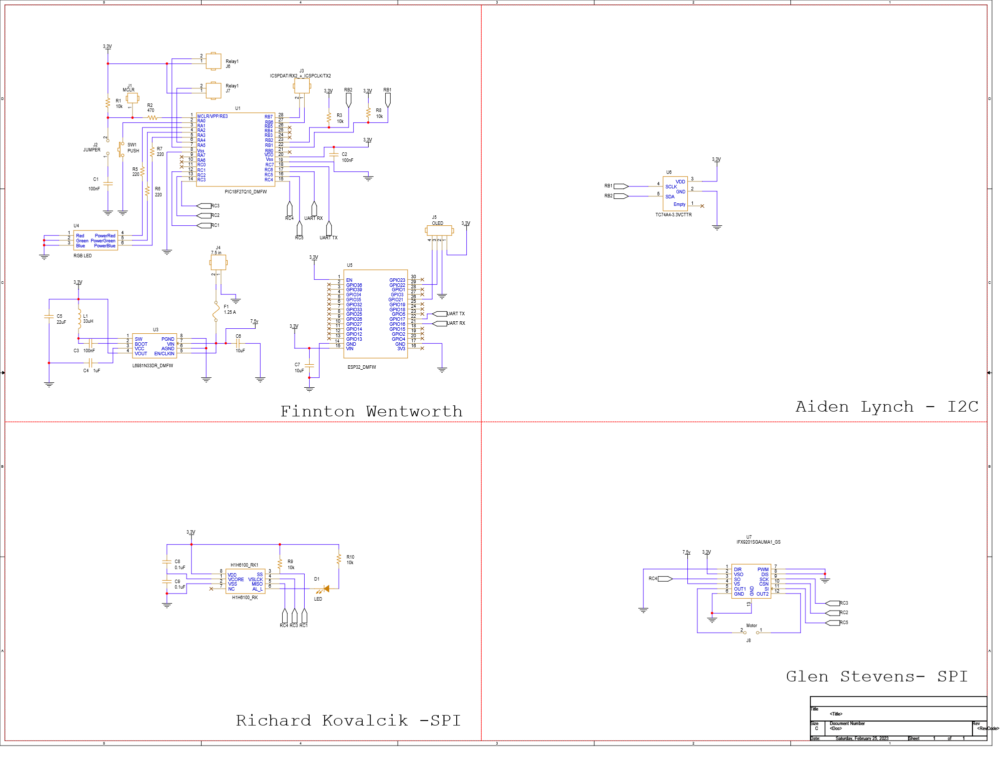
 
</div>

</figure>


<p align="center">Figure W: Team Schematic</p>

<figure class="image">  

<div style="text-align: center">  

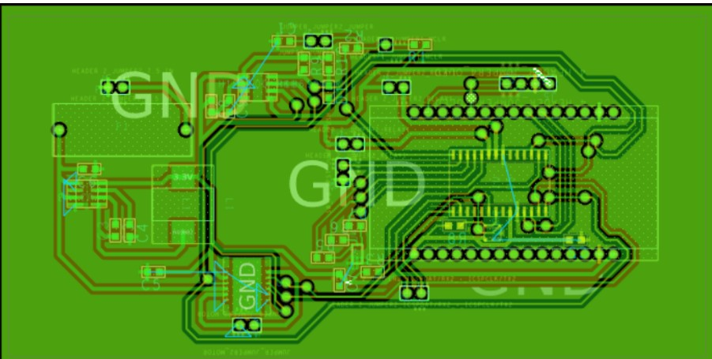<br>  

 </div>

</figure>

<p align="center">Figure X: Team PCB</p>


We made a couple of changes to our final PCB. We condensed the programming header to be smaller and we also reorganized our board to make it smaller and more condensed. We also had to change the traces to the humidity sensor to be I2C related instead of the SPI traces we have currently. Overall it was pretty similar in terms of footprints and layout besides these final changes. Alot of our lessons were learned between alpha boards and V1 boards.


Our Final Team Schematic can be found in **Figure Y.** 

<figure class="image">  

<div style="text-align: center">  

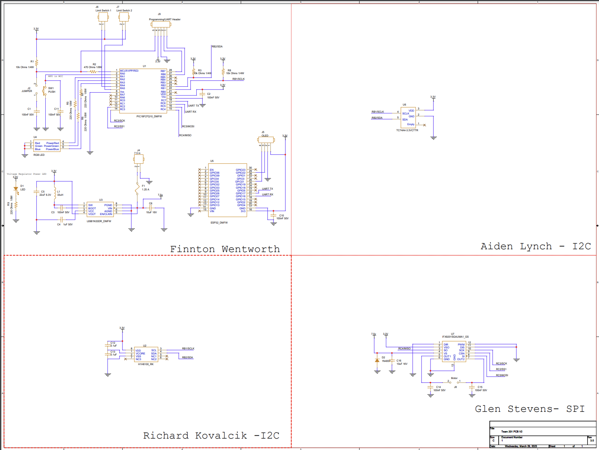<br>  

</div>

</figure>

<p align="center">Figure Y: Final Team Schematic</p>

We then had to reflect these changes in our final V2 Board. The front of our cadence model can be found in **Figure Z** while the back of our cadence model can be shown in **Figure AA.**

<figure class="image">  

<div style="text-align: center">  

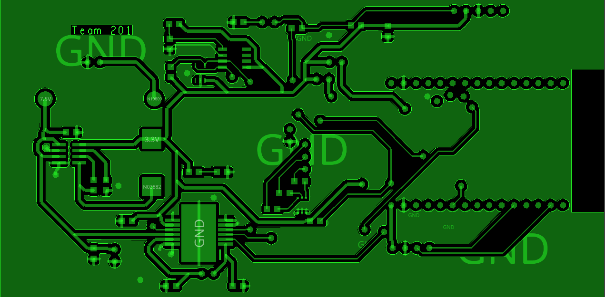<br>  

</div>

</figure>

<p align="center">Figure Z: Front Cadence Model</p>

<figure class="image">  

<div style="text-align: center">  

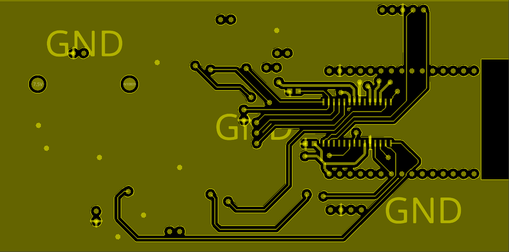<br>  

</div>

</figure>

<p align="center">Figure AA: Back Cadence Model</p>

After that we then soldered our components onto our team board. Our final V2 PCB pictures can be found in **Figure AB** and **Figure AC.**

<figure class="image">  

<div style="text-align: center">  

<br>  

</div>

</figure>

<p align="center">Figure AB: Front of PCB</p>

<figure class="image">  

<div style="text-align: center">  

<br>  

</div>

</figure>

<p align="center">Figure AC: Back of PCB</p>

In a 2.0 the first thing we would like to implement is dual motor control. We would have the motor that we had in our final 1.0 but we would also include a fan. This would allow the box to clear out the excess heat and humidity and prevent further damage to the components. We would have had to get a whole new motor driver and also have reprogrammed the fan to work inside of there. It was definitely possible but not within the time and budget constraints. Another thing we would like to do is implement the RGB LED better. We would put it on the outside so if someone is watching they could see the indicator instead of it being covered by the dome. We would also like to get an additional temperature and humidity sensor for the outside. This is a way for us to be able to gauge the outside temperature and the inside temperature. These double alerts could help the device open when it is safe to and not have to manually reset. Another idea we had was to swap connectors with batteries. A problem we had was our battery kept falling out and we were unable to keep powering. We would like to just have power going through it without having to constantly connect the battery.

## Software Implementation:

After we designed our schematic we wanted to have a strong understanding of how the code will operate. To do that we decided to make a diagram that shows the flow of our entire system. We wanted to go very in-depth so that similar to the schematic anyone with no prior knowledge of our project will be able to get a solid understanding of how it will work. Our inital Software Proposal is below in **Figure AD.**

<figure class="image">  

<div style="text-align: center">  

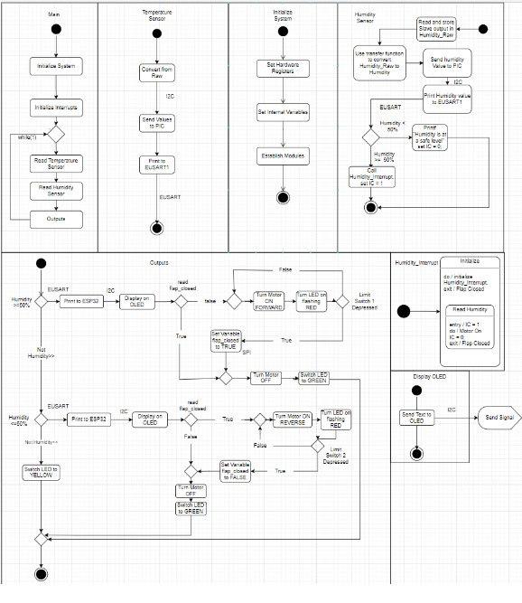<br>  

</div>

</figure>

<p align="center">Figure AD: Software Proposal</p>
  
The first block we have is the Main Loop which is a general overview of how the entire system will operate. The main loop’s first block is the Initialize System block where we set the variables that will be used through the code. It also provides some other start-up requirements that the program will need to operate. We then also Initialize the Interrupts which is a very important part of the Project Requirements. We then read the Temperature Sensor first due to the fact that the temperature sensor is just for data to notice trends. The temperature sensor will collect data and then send the values to PIC which will then in turn send the values to the OLED. This will be a constant stream of data that will be constantly being updated on the OLED Screen. The Humidity Sensor is similar but also is more crucial to the device. It starts off the same with how it receives the data and how it transmits to the OLED however it has the very interrupt. This is triggered when the sensor determines the humidity is in the upper half of the humidity range and when this occurs the interrupt will trigger. 

The last and most important block of the Software Diagram is the Output loop. There are two main instances in this block, when the humidity is greater than 50% and when it is below 50%. For the above 50% block the motor will turn on and the LED will flash red to indicate that the Dome is spinning shut. It will continue to do that until the first Limit Switch is depressed. When this happens the motor will turn on and the LED will switch to green to indicate that the motor is done. The other instance is when the humidity returns to an acceptable level. When this happens the motor will turn on in the other direction and the LED will flash red to indicate that the motor is moving. When the other Limit Switch is decompressed then the motor will shut off and the LED will flash back to green. If Humidity is currently not reading the LED will flash yellow to alert the user that there may be potential damage to the sensor. 

During all of these steps, the variables and information will be constantly printing to the ESP32, which will publish to a MQTT server,  and to an OLED screen so that the user will be constantly aware of what is happening. This connects back to the user needs part where users would like to know what the values are so they could analyze the trends. 

However, many changes were made from the original software proposal as our team progressed in our project. 

Our Final Software Implementation can be found below in **Figure AE**

<p align="center">
    <embed src="https://egr314-team201.github.io/report/media/SoftwareImplementation.pdf " 
       type="application/pdf"
       width = "600"
       height = "600"/>
</p>

<p align="center">Figure AE: Software Implementation</p>

Our team greatly simplified the execution of our code to ensure functionality. Our team had trouble implementing the pathways described on the original proposal, so one of our main goals was to reduce the complexity of the main while loop. Listed below is our five biggest changes from Software Proposal:

1. Simplifying Sensor Operation: The original software proposal featured splitting some functionality of motor control, reading, and printing values between the          Outputs block and the Humidity Block. Changing the diagram to keep the processes similar between the sensors improved readability and allowed for easier debugging. 

2. Use of Interrupts: Our team focused on implementing interrupt functionality not to spin motors, but to handle recieving EUART data on the RX line. This allowed us      to easily implement bidirectional communication through MQTT on our final product.

3. Simplifying Outputs: The outputs block had a large amount of information and checks within it. In our final realization of the software, we greatly simplified the      outputs block to two major checks: If the specific temperature and humidity values had been reached to begin spinning the motor, and then to check if the button had    been pressed.  

4. I/O Pin functionality: The final implementation of software heavily featured the use of our button pin, RA0. Adding functionality in code for the button helped our    team develop our final design and add an element of user interactivity to the project. 

5. LED outputs: Our team greatly increased the visual feedback of our code by increasing the amount of LED outputs or blinking. Changing ‘operation’ in our code was      accompanied by a change in the output of the RGB LED, which greatly helped our team debug our code. 

**Version 2.0**

Our project evolved immensely throughout the semester, and the final presented code was somewhat removed from our team’s original vision. Our team focused on creating a demonstrable model for the Innovation showcase, complete with greater button functionality than originally planned. A version 2.0 of our design’s software would look to increase the independence of operation from the user, remove blocking code, and improve the implementation of the RX interrupt. 

The button input on pin RA0 serves as a functional reset within the current design that was presented at the showcase. Within the current software, it allows the user to reset the position of the dome attached to the actuating motor, and resume reading new values within the main loop. This design would need to be changed to allow for remote reset for the original idea of a ‘place-and-forget’ design that our team ideated. Fixing this issue could be tied in with improving the RX interrupt. The current implementation of the RX interrupt simply toggles the green LED onboard when any message is received on the EUSART1 RX line. This could be changed to a set of conditionals to check for a variety of different received characters which could set the operation mode of the device. These modes could range from a standby mode, which could act as a low battery operation mode, stopping the transmission of messages, to a test mode for first set up and calibration.

More interfacing with the RX interrupt and MQTT could be implemented with string parsing to allow for two different kinds of setpoint control to be sent in a message: temperature regulation utilizing the proposed internal temperature sensors as described in “hardware 2.0” earlier as well as separate a separate variable that sets the number of transmitted messages per day. Limiting the number of messages sent per day would improve the battery life of our design, while removing the transmission of redundant information for a low change environment that our product is designed for. 

Greater use of interrupts would also remove the several while loops that our device sits in within the main “while(1)” loop that prevent updates to reading values or changing states. These are less relevant with the implementation of a once a day read, but as good practice these should be removed.


Shown below in **Figure AF: MCC Classic Pin Assignments**, is our MCC configuration for our pin assignments, which describes the pin functionality necessary for our software to function.  

<figure class="image">  

<div style="text-align: center">  

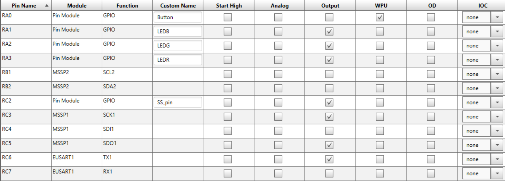<br>  

</div>

</figure>

<p align="center">Figure AF: MCC Classic Pin Assignments</p>

Our Final Code can be found below

```
#include "mcc_generated_files/mcc.h"
#include "mcc_generated_files/examples/i2c2_master_example.h"
#include <stdio.h>
#include <stdint.h>
#include <stdbool.h>

#define address 0x4C //Temp Address
#define HumAddress    0x27 //Humidity Address
#define HUMIDITYCONVERSION 70.57 //conversion factor for humidity values read from sensor 

void RxReceive(void){ //Interrupt
    EUSART1_Receive_ISR(); //If Message is sent to ESP32
    for(int i = 0; i <= 5; i++){ //Flash it 5 Times
       LEDG_Toggle();
       __delay_ms(100); 
    }
    LEDG_SetLow();  
}

void main(void)
{
    //Initializations
    SYSTEM_Initialize(); 
    I2C2_Initialize();
    EUSART1_Initialize();
    SPI1_Initialize();
    
    //Variables
    uint8_t temperature;
    uint8_t humidity;
    uint8_t dbuff[4];
    uint16_t conversion = 0;
    uint8_t dir1 = 0b11001111;
    uint8_t dir2 = 0b11111101;
    uint8_t stop = 0b11000000;
    uint8_t receive;
    
    
    double HumidityPer = 0; //Initialize Humidity
    SPI1_Open(SPI1_DEFAULT); //Open SPI

    //Interrupts
    INTERRUPT_GlobalInterruptEnable(); //
    INTERRUPT_PeripheralInterruptEnable();
    EUSART1_SetRxInterruptHandler(RxReceive);
    
    while(1)
    {
            temperature = I2C2_Read1ByteRegister(address, 0x00); //Read Temp
            float temperatureF = ((temperature*1.8) + 32); //Convert to F
            
            I2C2_ReadNBytes(0x27, dbuff, 1); //Read Humidity
            __delay_ms(38);
            I2C2_ReadNBytes(0x27, dbuff, 4);
            conversion = (dbuff[0] << 8 | dbuff[1]) & 0x3fff; //Convert Humidity
            __delay_ms(1000);
            HumidityPer = (((float)conversion / (16382)) * HUMIDITYCONVERSION); //Convert To Percentage

           

            //Normal Mode Where LED Is ON    
            if ((temperatureF <= 80 ) && (HumidityPer <= 55)) 
            {
                LEDR_SetLow();
                LEDG_SetHigh();
                LEDB_SetLow();
                __delay_ms(50);
                
            }
            //"Bad Mode" Where Conditions are not Ideal. Motor Will Activate
            else while (((temperatureF >= 80) || (HumidityPer >= 55)) && Button_GetValue() == 0)
            {
                LEDG_SetLow();
                LEDR_SetHigh(); 
                
                SS_pin_SetLow();
                __delay_ms(1000);
                SPI1_WriteByte(dir1);
                __delay_ms(500);
                SS_pin_SetHigh();
                
                __delay_ms(5000);
                
                SS_pin_SetLow();
                __delay_ms(1000);
                SPI1_WriteByte(stop);
                __delay_ms(500);
                SS_pin_SetHigh();
               
                while(Button_GetValue()  == 0){
                LEDR_SetHigh(); 
                __delay_ms(50);
                LEDR_SetLow();
                __delay_ms(50);
                printf("Humidity = %2.2f \r \n", HumidityPer);
                printf("TempF = %3.0f \r \n", temperatureF);
                }
                
            }
            printf("Humidity = %2.2f \r \n", HumidityPer);
            printf("TempF = %3.0f \r \n", temperatureF);
            SPI1_WriteByte(stop);
            __delay_ms(1000);
        
        // Reset Where Button Is Pressed 
        while (Button_GetValue() == 1)
        {      
            LEDR_SetLow();
            LEDG_SetHigh();
            __delay_ms(500);
            LEDG_SetLow();
         
            SS_pin_SetLow();
            __delay_ms(1000);
           SPI1_WriteByte(dir2);
            __delay_ms(500);
            SS_pin_SetHigh();
        }
        //Stop the Motor and Restart Code
            SS_pin_SetLow();
            __delay_ms(1000);
           SPI1_WriteByte(stop);
            __delay_ms(500);
            SS_pin_SetHigh();
    }
}
```

Our final Topic Table can be found in **Figure AG**

<figure class="image">  

<div style="text-align: center">  

<br>  

</div>

</figure>

<p align="center">Figure AG: Topic Table</p>

## System Verification:

For final checkoffs we needed to verify that everything was working. We needed to verify that everything was reciving power and also that everything was able to be be programmed. After being to able to get everything working in tandem we were able to get fully verified and checked off. Our final System Verifcation Table can be found in **Figure AH**

<figure class="image">  

<div style="text-align: center">  

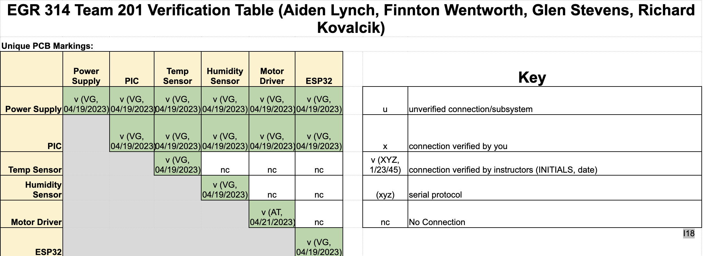<br>  

</div>

</figure>

<p align="center">Figure AH: System Verification</p>

## Lessons Learned:

Throughout the course of this project, we learned alot about embedded systems and what it meant to build a successful project. As a team, we all sat down and reminisced about the semester and came up with the top 10 lessons we learned throughout the semester. 

The first lesson we learned was to fully read the datasheet. During the PCB design process, we had to redo the motor driver footprint multiple times due to not reading the datasheet and getting the dimensions wrong. After we made that mistake we ensured that the dimensions were correct on the V2 board. 

The second lesson we learned was to fully read the hardware orders. Our original design had the humidity sensor be an SPI chip, however, we ended up ordering only I2C chips. Due to these being expensive and having an unideal lead time we could not order more. This resulted in us having to completely shift our project to have both sensors utilize I2C. We then made sure we were ordering the correct part whenever we ordered components. 

The third lesson we learned was to make sure that the datasheet was informative. When we ordered the button we ordered it based on aesthetics and not functionality. As a result, when we were tested we had no idea how the button actually worked. It took us more time than we would have liked to fully understand it and how to implement it in our code. 

The fourth lesson we learned was to make sure that the dimensions of a component are reasonable. When we ordered the RGB LED we never looked at the dimensions of the pins and when it came to soldering it onto the board it was near impossible to solder on with the tools we had. The result of this mistake was that we only could choose two colors instead of the three we initially thought. The project ultimately still worked the same but it was an important lesson to learn as it took us very long to solder effectively. 

The fifth lesson we learned was to make sure that everything was soldered correctly. When were testing the motor driver we accidentally dripped a piece of solder onto two traces which would cause the motor driver to short whenever it tried to turn in a second direction. We ended up burning out 7 motor drivers before we finally found out the problem. So whenever we soldered we diligently checked continuity. 

The sixth lesson we learned was to ensure that you were programming to the right pins in MPLABX. For the motor driver, we had the Master and Slave inputs flipped around. This means we could not actually send any data to the motor driver all because we had them flipped around. 

The seventh lesson we learned was to make sure you are reading the right address. For our temp sensor, we were misreading the number on the chip which prevented us from successfully reading values. We learned it quickly and made sure that the address was 100% right with the humidity sensor. 

The eighth lesson we learned was to make sure you are reading the proper conversion function. For our humidity sensor, we were not ever converting it to the right function. This resulted in us getting crazy high numbers or just constantly reading zeros which are both not accurate or helpful. We then had to do alot of research on the conversion function and then after some testing and modifications, we finally got it to print an accurate reading.

The ninth lesson we learned was that it is okto change software. Initially, we wanted to follow our software proposal with every line of code but we were struggling. We were scared to venture into new territory but once we tried it actually made our project better. It allowed us to customize it to what we thought was ideal and then we just had to change our software implementation retroactively.

The tenth lesson we learned was that we needed to order more components. When we ordered we were trying to be financially responsible for it and only add a couple of extras. By the time we got to our final design, we completely ran out of all our components. If one component stopped working that we were in a really bad situation due to having no extra components. 

Overall we learned alot this semester and we will be taking this into our future capstone projects.


## Recomendations For Future EGR314 Students

1. Practice and Continue to Learn in C. Practicing the basics will allow for less time to be wasted on trying to fix simple coding errors.

2. Read and Verify with the Data Sheet. Our team made a couple of mistakes because we did not fully read the datasheets such as ordering the wrong type of chip. Verifying before printing your PCB and ordering parts can save alot of time and hassle.

3. Really be aware of how you want your project to operate from start to finish. This is really helpful for projects such as the software diagram where you need to have every action listed.

4. Fully Understand the ICCs and the Homework. Alot of our project was based on the ICCs and HW so when we started designing and writing code we had a good starting point.

5. Choose components with strong and detailed Data Sheets. The more information you have regarding a chip the better. The Data Sheet will be able to provide alot of useful tips that can help while debugging.

## Appendix A: Team Organization

[Team Organization Assignment](https://egr314-team201.github.io/Assignments/TeamOrganization/)
    
## Appendix B: User Needs and Benchmarking

[User Needs and Benchmarking](https://egr314-team201.github.io/Assignments/User-Needs/)
  
## Appendix C: Project Requirements Document

[Project Requirements Document](https://egr314-team201.github.io/Assignments/Product-Requirements/)

## Appendix D: Block Diagram

[Block Diagram](https://egr314-team201.github.io/Assignments/block-diagram/)

## Appendix E: Microcontroller Selection

[Microcontroller Selection](https://egr314-team201.github.io/Assignments/microcontroller-selection/)

## Appendix F: Component Selection

[Component Selection](https://egr314-team201.github.io/Assignments/component-selection/)

## Appendix G: Bill of Materials

[Bill of Materials](https://egr314-team201.github.io/Assignments/Bill-of-Materials/)

## Appendix H: Power Budget

[Power Budget](https://egr314-team201.github.io/Assignments/power-budget/)

<style> .sidebar { display: none; } </style> 
